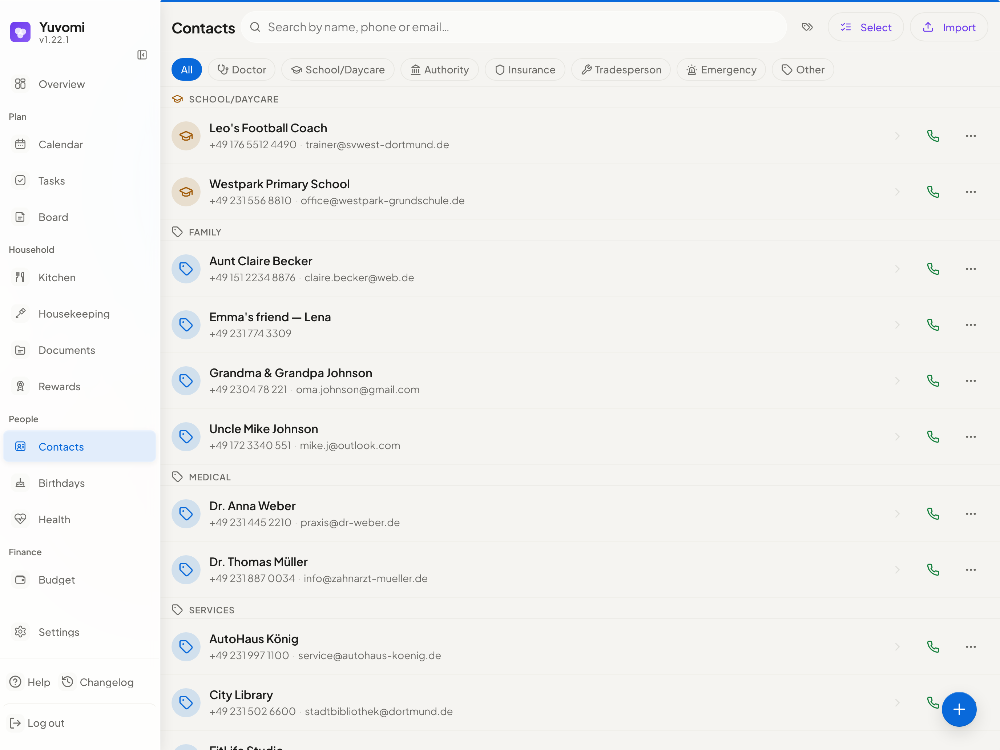

<div align="center">
  <sub><a href="README.md">English</a> &nbsp;·&nbsp; <b>Deutsch</b></sub>

  

  <h1>Yuvomi</h1>
  <p><strong>Der selbstgehostete Familienplaner. Privat, offline-fähig und schön.</strong></p>

  <p>
    <a href="LICENSE"></a>
    <a href="https://github.com/ulsklyc/yuvomi/releases"></a>
    <a href="https://github.com/ulsklyc/yuvomi/pkgs/container/yuvomi"></a>
    <a href="https://nodejs.org"></a>
    
  </p>

  <p>
    <a href="docs/installation.md"><strong>→ Installieren</strong></a> &nbsp;·&nbsp;
    <a href="https://yuvomi.cloud/"><strong>Website & Screenshots</strong></a> &nbsp;·&nbsp;
    <a href="docs/SPEC.md"><strong>Doku</strong></a> &nbsp;·&nbsp;
    <a href="CHANGELOG.md"><strong>Changelog</strong></a>
  </p>
</div>

<br>

<div align="center">
  <table>
    <tr>
      <td align="center"><b>16</b><br><sub>Module</sub></td>
      <td align="center"><sub>·</sub></td>
      <td align="center"><b>23</b><br><sub>Sprachen</sub></td>
      <td align="center"><sub>·</sub></td>
      <td align="center"><b>0</b><br><sub>Tracker</sub></td>
      <td align="center"><sub>·</sub></td>
      <td align="center"><b>AES-256</b><br><sub>optionale DB-Verschlüsselung</sub></td>
      <td align="center"><sub>·</sub></td>
      <td align="center"><b>MIT</b><br><sub>Lizenz</sub></td>
    </tr>
  </table>
</div>

<br>

<div align="center">
  <table>
    <tr>
      <td width="72%" align="center">
        <picture>
          <source media="(prefers-color-scheme: dark)" srcset="docs/screenshots/dashboard-dark-web.png">
          <source media="(prefers-color-scheme: light)" srcset="docs/screenshots/dashboard-light-web.png">
          
        </picture>
      </td>
      <td width="28%" align="center" valign="middle">
        <picture>
          <source media="(prefers-color-scheme: dark)" srcset="docs/screenshots/dashboard-dark-mobile.png">
          <source media="(prefers-color-scheme: light)" srcset="docs/screenshots/dashboard-light-mobile.png">
          
        </picture>
        <br>
        <sub>Mobile PWA</sub>
      </td>
    </tr>
  </table>
  <sub>Für die dunkle Ansicht GitHub auf Dark Mode umstellen.</sub>
</div>

<br>

Yuvomi hält deinen Haushalt organisiert — Aufgaben, Einkäufe, Mahlzeiten, Kalender, Budget und mehr — an einem privaten Ort, ohne Cloud-Konten oder Abos. Läuft als Docker- oder Podman-Container auf jedem Home-Server oder NAS, inklusive rootless Podman auf SELinux-aktivierten RHEL-/Fedora-/CentOS-Stream-Systemen. Eine ausgefeilte, mobile-first PWA lässt es sich auf jedem Gerät nativ anfühlen.

Jedes Modul ist eigenständig. Nutze, was passt, lass weg, was nicht passt.

<details>
<summary><sub>Kommst du von <b>Oikos</b>? Das Projekt wurde umbenannt — an der App ändert sich nichts.</sub></summary>

<br>

Yuvomi wurde von **Oikos** umbenannt, um einen Markenkonflikt mit einem unabhängigen Produkt zu vermeiden. Gleicher Code, gleiche Daten, gleicher Maintainer.

- Alte Links (`github.com/ulsklyc/oikos`) leiten automatisch hierher weiter.
- Das Docker-Image liegt jetzt unter `ghcr.io/ulsklyc/yuvomi`; das alte `ghcr.io/ulsklyc/oikos` funktioniert weiterhin — bitte bei Gelegenheit umstellen.
- Bestehende Daten und Einstellungen bleiben beim Upgrade vollständig erhalten.

Neues Zuhause: **https://yuvomi.cloud/** · Fragen? Eröffne eine [Diskussion](https://github.com/ulsklyc/yuvomi/discussions).

</details>

<div align="center">
  <sub>
    <a href="#app-screenshots">Screenshots</a> &nbsp;·&nbsp;
    <a href="#module">Module</a> &nbsp;·&nbsp;
    <a href="#design--technik">Design</a> &nbsp;·&nbsp;
    <a href="#überall-installieren">Installieren</a> &nbsp;·&nbsp;
    <a href="#tech-stack">Tech-Stack</a> &nbsp;·&nbsp;
    <a href="#dokumentation">Doku</a>
  </sub>
</div>

---

## App-Screenshots

<div align="center">
  <table>
    <tr>
      <td align="center" width="50%">
        <picture>
          <source media="(prefers-color-scheme: dark)" srcset="docs/screenshots/tasks-dark-web.png">
          <source media="(prefers-color-scheme: light)" srcset="docs/screenshots/tasks-light-web.png">
          
        </picture>
        <br><sub><b>Aufgaben</b> — Kanban-Board, wiederkehrende Termine, Mehrfachzuweisung</sub>
      </td>
      <td align="center" width="50%">
        <picture>
          <source media="(prefers-color-scheme: dark)" srcset="docs/screenshots/calendar-dark-web.png">
          <source media="(prefers-color-scheme: light)" srcset="docs/screenshots/calendar-light-web.png">
          
        </picture>
        <br><sub><b>Kalender</b> — Google-OAuth, iCloud, CalDAV, ICS-Abos &amp; -Import</sub>
      </td>
    </tr>
    <tr>
      <td align="center">
        <picture>
          <source media="(prefers-color-scheme: dark)" srcset="docs/screenshots/budget-dark-web.png">
          <source media="(prefers-color-scheme: light)" srcset="docs/screenshots/budget-light-web.png">
          
        </picture>
        <br><sub><b>Budget</b> — Einnahmen, Ausgaben, geteilte Kosten, CSV-Export</sub>
      </td>
      <td align="center">
        <picture>
          <source media="(prefers-color-scheme: dark)" srcset="docs/screenshots/meals-dark-web.png">
          <source media="(prefers-color-scheme: light)" srcset="docs/screenshots/meals-light-web.png">
          
        </picture>
        <br><sub><b>Mahlzeiten</b> — Wochenplaner, Rezepte, Ein-Klick-Einkaufsexport</sub>
      </td>
    </tr>
    <tr>
      <td align="center">
        <picture>
          <source media="(prefers-color-scheme: dark)" srcset="docs/screenshots/shopping-dark-web.png">
          <source media="(prefers-color-scheme: light)" srcset="docs/screenshots/shopping-light-web.png">
          
        </picture>
        <br><sub><b>Einkauf</b> — geteilte Listen, Gang-Gruppen, Wischgesten</sub>
      </td>
      <td align="center">
        <picture>
          <source media="(prefers-color-scheme: dark)" srcset="docs/screenshots/contacts-dark-web.png">
          <source media="(prefers-color-scheme: light)" srcset="docs/screenshots/contacts-light-web.png">
          
        </picture>
        <br><sub><b>Kontakte</b> — Familienverzeichnis, CardDAV-Sync</sub>
      </td>
    </tr>
  </table>
  <a href="https://yuvomi.cloud/">Alle Screenshots ansehen →</a>
</div>

---

## Module

| | Modul | Was es macht |
|:---:|---|---|
|  | **Aufgaben** | Fristen, Prioritäten, Teilaufgaben, wiederkehrende Termine, Zuweisung an mehrere Mitglieder, Sichtbarkeit je Aufgabe (nur ich / Zugewiesene / alle), ein „Mir zugewiesen"-Filter und ein Kanban-Board. Optionaler CalDAV-Import von Apple Erinnerungen. |
|  | **Einkauf** | Gemeinsame, nach Gang gruppierte Listen mit Wischgesten, Notizen je Artikel und Ein-Tipp-Import aus dem Mahlzeitenplan. |
|  | **Mahlzeiten** | Wochenplaner mit mehreren Einträgen pro Slot, wöchentlicher Wiederholung, einer Drag-and-drop-Rezept-Seitenleiste, einem Ein-Klick-Wochen-Zufallsgenerator und direktem Export in die Einkaufsliste. |
|  | **Rezepte** | Rezepte erstellen, duplizieren und skalieren; Mahlzeiten-Slots vorbefüllen oder jede geplante Mahlzeit als Rezept speichern. |
|  | **Kalender** | Google- (OAuth) und CalDAV-Sync (iCloud, Nextcloud, Radicale), ICS-Abos, einmaliger Import aus einer `.ics`-Datei oder einem geteilten Feed als bearbeitbare lokale Termine, wiederkehrende Termine, Anhänge, Feiertags-Overlays, Stichwortsuche über Titel, Ort und Notizen (akzentunabhängig, findet auch Termine mit unbekanntem Datum), ein „Mir zugewiesen"-Filter, Sichtbarkeit je Termin, eine Standard-Zuweisung je synchronisiertem Kalender, zugewiesene Mitglieder als Avatare auf jedem Termin, einen wählbaren Wochenstart (Montag, Sonntag oder Samstag) und ein schreibgeschützter `webcal://`-Export-Feed, der die zugewiesenen Mitglieder optional im Termintitel zeigen kann. |
|  | **Dokumente** | Familiendateien hochladen, taggen, vorschauen und organisieren, mit Sichtbarkeit je Dokument. Optionaler lokaler Ordner- oder WebDAV-Speicher sowie Paperless-ngx- und Papra-(DMS-)Anbindung. |
|  | **Budget** | Einnahmen, Ausgaben, wiederkehrende Buchungen, Trend-Charts, ein Statistik-Tab, CSV-Export, Konten mit Startsaldo und laufendem Kontostand samt Nettovermögen, Kredite, geteilte Ausgaben, Abo-Tracking mit Verlängerungen und Währungen sowie ein Plan-Tab mit monatlichen Kategorie-Budgets und einem Sparziel (Soll vs. Ist). |
|  | **Haushaltshilfe** | Personal verwalten — Dienstpläne, Ein-/Auschecken, Tages- oder Stundenabrechnung, Aufgaben und Materialanforderungen. |
|  | **Belohnungen** | Punktwerte auf Aufgaben schreiben zugewiesenen Mitgliedern gut; ein Belohnungskatalog mit elterlich freigegebenen Einlösungen, Opt-in je Mitglied und einem prüfbaren Punktekonto. |
|  | **Gesundheit** | Vitalwerte je Mitglied, Medikamente mit Nachfüll-Warnungen, Laborwerte, Aktivitätsprotokolle und Zyklus-Tracking (Perioden-Vorhersagen, fruchtbares Fenster, Zyklus-Ring, Schwangerschafts-Modus) — mit Trend-Charts, CSV-Export und Sichtbarkeit je Eintrag. |
|  | **Notizen & Kontakte** | Bunte Markdown-Notizzettel plus ein Kontaktverzeichnis mit CardDAV-Sync. |
|  | **Geburtstage** | Geburtstags-Tracker mit automatischen Kalenderterminen, Altersanzeige und eigenen Erinnerungen. |
|  | **Familie** | Mitgliederprofile mit Rollen, Fotos und Kontaktdaten — synchronisiert mit Kontakten und Geburtstagen. |
|  | **Erinnerungen** | Erinnerungen zu Aufgaben und Terminen per In-App-Badge, Opt-in-Web-Push (HTTPS) und Haushalts-Kanälen über Gotify/ntfy. |
|  | **API-Tokens** | Bearer-/X-API-Key-Tokens mit OpenAPI-3.0-Spec und eingebautem MCP-Endpunkt (`/mcp`), über den KI-Agenten wie Claude Desktop die gesamte API in natürlicher Sprache steuern. Optionale Modul-Scopes (Lesen/Schreiben) halten ein Token — etwa für einen KI-Client — von sensiblen Bereichen fern. |
|  | **Backup** | Manuelles und geplantes Datenbank-Backup/-Restore mit automatischem Rollback vor dem Zurückspielen. Optionales WebDAV-Upload-Ziel (Nextcloud, ownCloud usw.). |

<sub>Vollständiges Datenmodell und Modul-Details in der <a href="docs/SPEC.md">Spec</a>.</sub>

> **Gesundheit ist kein Medizinprodukt** — keine diagnostischen Aussagen. Gesundheitsdaten sind sensibel; aktiviere die Datenbankverschlüsselung (`DB_ENCRYPTION_KEY`, SQLCipher).

> **WebDAV-Dokumentenspeicher braucht ein eigenes Backup.** Datenbank-Backups enthalten Metadaten und Verweise auf Dokumente, nicht die Binärdateien auf WebDAV — sichere dieses Ziel separat. WebDAV-Ziele aus der Admin-Oberfläche müssen zu öffentlichen Adressen auflösen; für ein vertrauenswürdiges LAN- oder Loopback-Ziel setze `DOCUMENT_STORAGE_WEBDAV_URL` über die Deployment-Umgebung.

---

## Design & Technik

- **Disziplinierte Liquid-Glass-UI** — lesbare Arbeitsflächen, dezent transluzente Navigation, Spring-Animationen und modul-getönte Overlays — in reinem CSS gebaut, ohne Framework
- **PWA** — auf jedem Gerät installierbar, offline nutzbar (schreibgeschützter Zugriff auf zuletzt gesehene Kalender-, Aufgaben-, Einkaufs-, Kontakt- und Dashboard-Daten) und von Smartphone bis Desktop responsiv, mit persistenter mobiler Leiste, konfigurierbaren Favoriten und optimierten Touch-Zielen
- **Datenschutz zuerst** — vollständig selbstgehostet, optionale SQLCipher-AES-256-Datenbankverschlüsselung (im empfohlenen Docker-Setup aktiv), keine Telemetrie
- **SSO / OpenID Connect** — optionales Single Sign-on über jeden OIDC-Provider (Authentik, Keycloak, Google, Microsoft Entra), konfiguriert mit vier Umgebungsvariablen; Authorization-Code- + PKCE-Flow
- **Self-Service-Passwort-Reset** — optionales SMTP lässt Nutzer ein vergessenes Passwort selbst per zeitlich begrenztem E-Mail-Link zurücksetzen; enumerationssicher by design
- **Kein Build-Schritt** — reine ES-Module, kein Bundler, kein Transpiler, kein Framework
- **Mehrsprachig** — 23 Sprachen mit automatischer Locale-Erkennung (de, en, es, fr, it, sv, el, ru, tr, zh, ja, ar, hi, pt, uk, pl, nl, cs, vi, hu, ko, id, fa)

---

## Überall installieren

### Web-Installer (empfohlen)

Ein lokalisierter Setup-Assistent — 23 Sprachen — der im Browser läuft. Erkennt Docker oder Podman automatisch, konfiguriert HTTPS, SSO und geplante Backups, startet dann den Container und legt dein Admin-Konto an.

```bash
git clone https://github.com/ulsklyc/yuvomi.git && cd yuvomi
node tools/installer/install-server.js
```

Öffne **http://localhost:8090**. Benötigt Node.js 18+ auf dem Host für den Installer — der App-Container bringt sein eigenes Node 22 mit.

### Docker / Podman

**Vorgefertigtes Image:**

```bash
curl -O https://raw.githubusercontent.com/ulsklyc/yuvomi/main/docker-compose.yml
curl -O https://raw.githubusercontent.com/ulsklyc/yuvomi/main/.env.example
cp .env.example .env          # SESSION_SECRET und DB_ENCRYPTION_KEY setzen
docker compose up -d
```

**Aus dem Quellcode bauen:**

```bash
git clone https://github.com/ulsklyc/yuvomi.git && cd yuvomi
cp .env.example .env
docker compose up -d --build
```

Öffne `http://localhost:3000`. Der erste Besuch führt dich durch die Anlage deines Admin-Kontos.

> **Podman (RHEL / Fedora / CentOS Stream):** Beide Installer erkennen Podman automatisch und nutzen `podman-compose.yml` mit SELinux-`:Z`-Labels. Für einen manuellen Start: `podman compose -f podman-compose.yml up -d`. Rootless-systemd-Autostart: `tools/quadlet/oikos.container`.

### NAS & Home-Server

<table>
  <tr>
    <td><b>TrueNAS SCALE</b></td>
    <td>Apps → Discover Apps → nach <b>Yuvomi</b> suchen → Install</td>
    <td>Kein Terminal nötig. Community-Apps-Katalog. Versions-Updates via Renovate.</td>
  </tr>
  <tr>
    <td><b>Umbrel</b></td>
    <td>App Store → nach <b>Yuvomi</b> suchen → Install</td>
    <td>Ein-Klick-Installation. Alles bleibt auf deinem Umbrel.</td>
  </tr>
  <tr>
    <td><b>Unraid</b></td>
    <td>Apps → nach <b>Yuvomi</b> suchen → Apply</td>
    <td>Community-Applications-Template. <code>SESSION_SECRET</code> bei der Installation setzen.</td>
  </tr>
</table>

> **Katalog-Einträge sind weiterhin unter dem alten Namen `oikos` registriert** (TrueNAS `oikos_community`, Unraid `oikos-…`). Die App zeigt und installiert sich als **Yuvomi** — der technische Slug bleibt erhalten, damit bestehende Installationen (Datenbankpfade und Containernamen) nahtlos aktualisieren statt zu brechen. Suche nach **Yuvomi**; taucht ein Store den Eintrag noch als *oikos* auf, ist es dieselbe App.

> **Neu bei Docker oder Podman?** Der **[Installations-Leitfaden](docs/installation.md)** deckt Engine-Setup, HTTPS/Reverse-Proxy, Backups und Troubleshooting Schritt für Schritt ab.

---

## Tech-Stack

<p>
  
  
  
  
  
  
  
</p>

---

## Dokumentation

[Installation](docs/installation.md) &nbsp;·&nbsp; [Spec & Datenmodell](docs/SPEC.md) &nbsp;·&nbsp; [Module](MODULES.md) &nbsp;·&nbsp; [Mitwirken](CONTRIBUTING.md) &nbsp;·&nbsp; [Sicherheit](SECURITY.md) &nbsp;·&nbsp; [Datenschutz für Selbsthoster](docs/PRIVACY-FOR-SELFHOSTERS.md) &nbsp;·&nbsp; [Changelog](CHANGELOG.md) &nbsp;·&nbsp; [Backlog](BACKLOG.md)

Wenn du Yuvomi in einem DSGVO-Kontext selbst hostest (EU/EWR, Verarbeitung fremder Daten), lies [docs/PRIVACY-FOR-SELFHOSTERS.md](docs/PRIVACY-FOR-SELFHOSTERS.md) vor dem Produktivbetrieb: Es behandelt Drittland-Bewertungen für jeden externen Dienst (Wetter, CalDAV/CardDAV, OIDC, WebDAV-Backup und Dokumentenspeicher), Hinweise zu Auftragsverarbeitungsverträgen, Empfehlungen zur Log-Aufbewahrung und eine Vorlage für das Verzeichnis von Verarbeitungstätigkeiten.

---

## Lizenz

MIT — siehe [LICENSE](LICENSE).

<div align="center">
  <br>
  <sub>Mit Sorgfalt gebaut für Familien, die Privatsphäre und Einfachheit schätzen.</sub>
</div>
