<div align="center">
  

  <h1>Yuvomi</h1>

  <p><strong>Ein privates Zuhause für alles, was deine Familie am Laufen hält.</strong></p>

  <p>
    Aufgaben, Kalender, Budget, Einkauf, Mahlzeiten, Gesundheit und mehr, selbstgehostet auf deinem
    eigenen Server. Keine Cloud-Konten. Keine Abos. Null Tracker. Die Daten deiner Familie bleiben deine.
  </p>

  <p>
    <a href="https://github.com/ulsklyc/yuvomi/releases"></a>
    <a href="https://github.com/ulsklyc/yuvomi/stargazers"></a>
    
    <a href="https://github.com/ulsklyc/yuvomi/pkgs/container/yuvomi"></a>
    <a href="LICENSE"></a>
  </p>

  <p>
    <a href="#überall-installieren"><strong>→ In Minuten installieren</strong></a> &nbsp;·&nbsp;
    <a href="https://yuvomi.cloud/"><strong>Live-Demo &amp; Screenshots</strong></a> &nbsp;·&nbsp;
    <a href="docs/SPEC.md"><strong>Doku</strong></a> &nbsp;·&nbsp;
    <a href="CHANGELOG.md"><strong>Changelog</strong></a>
  </p>

  <sub>Die englische Fassung (<a href="README.md">README.md</a>) ist die maßgebliche; diese Übersetzung folgt ihr.</sub>
</div>

<br>

<div align="center">
  <table>
    <tr>
      <td width="72%" align="center">
        <picture>
          <source media="(prefers-color-scheme: dark)" srcset="docs/screenshots/de/dashboard-dark-web.png">
          <source media="(prefers-color-scheme: light)" srcset="docs/screenshots/de/dashboard-light-web.png">
          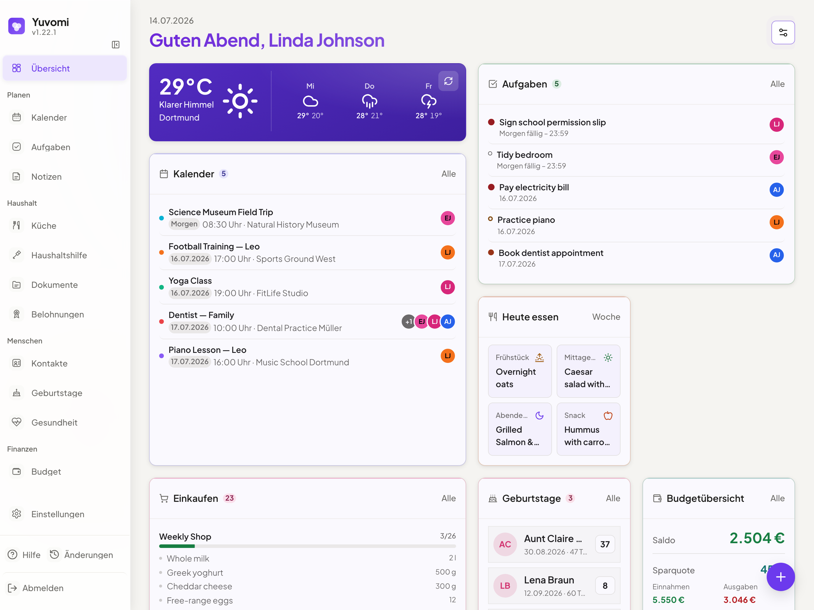
        </picture>
      </td>
      <td width="28%" align="center" valign="middle">
        <picture>
          <source media="(prefers-color-scheme: dark)" srcset="docs/screenshots/de/dashboard-dark-mobile.png">
          <source media="(prefers-color-scheme: light)" srcset="docs/screenshots/de/dashboard-light-mobile.png">
          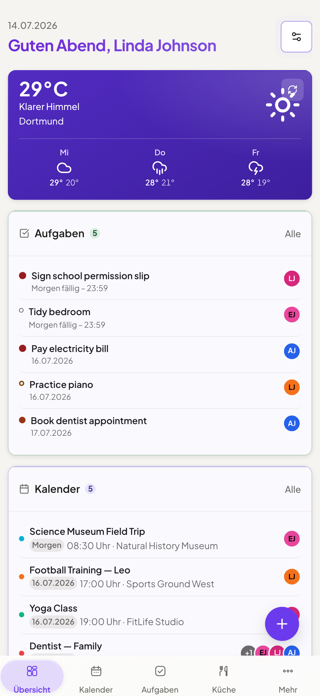
        </picture>
        <br>
        <sub>Mobile PWA</sub>
      </td>
    </tr>
  </table>
  <sub>Für die dunkle Ansicht GitHub auf Dark Mode umstellen.</sub>
</div>

<br>

<div align="center">
  <table>
    <tr>
      <td align="center"><b>17</b><br><sub>Module</sub></td>
      <td align="center"><sub>·</sub></td>
      <td align="center"><b>24</b><br><sub>Sprachen</sub></td>
      <td align="center"><sub>·</sub></td>
      <td align="center"><b>0</b><br><sub>Tracker</sub></td>
      <td align="center"><sub>·</sub></td>
      <td align="center"><b>AES-256</b><br><sub>optionale DB-Verschlüsselung</sub></td>
      <td align="center"><sub>·</sub></td>
      <td align="center"><b>MIT</b><br><sub>Lizenz</sub></td>
    </tr>
  </table>
</div>

<br>

Yuvomi ersetzt einen Stapel Cloud-Abos durch einen privaten Ort, der deinem Haushalt gehört, nicht einem Anbieter. Es läuft als Docker- oder Podman-Container auf jedem Home-Server oder NAS, inklusive rootless Podman auf SELinux-aktivierten RHEL-, Fedora- und CentOS-Stream-Systemen. Eine ausgefeilte, mobile-first PWA lässt es sich auf jedem Gerät nativ anfühlen. Jedes Modul ist eigenständig - nutze, was passt, lass weg, was nicht passt.

<div align="center">
  <sub>
    <a href="#warum-yuvomi">Warum Yuvomi</a> &nbsp;·&nbsp;
    <a href="#screenshots">Screenshots</a> &nbsp;·&nbsp;
    <a href="#module">Module</a> &nbsp;·&nbsp;
    <a href="#überall-installieren">Installieren</a> &nbsp;·&nbsp;
    <a href="#faq">FAQ</a> &nbsp;·&nbsp;
    <a href="#unter-der-haube">Unter der Haube</a> &nbsp;·&nbsp;
    <a href="#dokumentation">Doku</a>
  </sub>
</div>

---

## Warum Yuvomi

Die meisten Familien kleben ihren Alltag aus einem Dutzend Bezahl-Apps zusammen, jede mit eigenem Konto, eigenem Abo und einer eigenen Kopie deiner Daten auf fremden Servern. Yuvomi bringt das alles an einen Ort, der dir gehört.

### Eine private App statt einem Dutzend Abos

| Statt zu jonglieren mit… | gibt dir Yuvomi |
|---|---|
| einer To-do- &amp; Aufgaben-App | **Aufgaben** - Kanban, Fristen, Wiederholungen, Mehrfachzuweisung |
| einem Abo für den geteilten Kalender | **Kalender** - Sync, Abos, Sichtbarkeit je Termin |
| einer Kosten-Splitting-App | **Geteilte Ausgaben** - gemeinsame Kosten mit Schuldenvereinfachung |
| einer Budget-App | **Budget** - Einnahmen, Ausgaben, Konten, Sparziele |
| einer Essensplaner- &amp; Rezept-App | **Mahlzeiten &amp; Rezepte** - Wochenplaner mit Einkaufsexport |
| einer Einkaufslisten-App | **Einkauf** - geteilte, nach Gang sortierte Listen |
| einem Vorrats- &amp; MHD-Tracker | **Vorrat** - Bestand, Lagerort, Mindesthaltbarkeitsdaten |
| einem Dokumentenmanager | **Dokumente** - getaggte, durchsuchbare Familiendateien |
| einer Notiz-App &amp; Kontakte-Sync | **Notizen &amp; Kontakte** - Markdown-Notizen, CardDAV-Sync |

<br>

<table>
  <tr>
    <td width="50%" valign="top">
      <b>Privat by Design</b><br>
      <sub>Selbstgehostet auf deiner Hardware. Optionale SQLCipher-AES-256-Datenbankverschlüsselung, keine Telemetrie, keine Tracker und keine Konten außer denen deines Haushalts. Interne (LAN-)Ziele sind standardmäßig blockiert; SSO und Self-Service-Passwort-Reset sind Opt-in.</sub>
    </td>
    <td width="50%" valign="top">
      <b>Läuft auf jedem Gerät</b><br>
      <sub>Eine installierbare PWA, die sich vom Smartphone bis zum Desktop nativ anfühlt. Funktioniert offline mit Lesezugriff auf zuletzt gesehene Kalender-, Aufgaben-, Einkaufs-, Kontakt- und Dashboard-Daten. Optimierte Touch-Ziele, eine persistente mobile Leiste und konfigurierbare Favoriten.</sub>
    </td>
  </tr>
  <tr>
    <td width="50%" valign="top">
      <b>Für die ganze Familie</b><br>
      <sub>Jedes Mitglied ist ein Nutzer, nicht nur der Admin. Rollen, Fotos, Avatare auf Terminen und Aufgaben und Sichtbarkeit je Eintrag (nur ich / Zugewiesene / alle), damit Privates privat bleibt und der gemeinsame Kalender gemeinsam.</sub>
    </td>
    <td width="50%" valign="top">
      <b>Bleibt deins</b><br>
      <sub>MIT-lizenziert und kostenlos. Deine Daten liegen auf deinem Server, exportieren sich als CSV, ICS und vCard und sichern sich nach deinem Zeitplan. Kein Lock-in, keine Preiserhöhungen, keine Abschalt-Ankündigung.</sub>
    </td>
  </tr>
</table>

---

## Screenshots

<div align="center">
  <table>
    <tr>
      <td align="center" width="50%">
        <picture>
          <source media="(prefers-color-scheme: dark)" srcset="docs/screenshots/de/health-cycle-dark-web.png">
          <source media="(prefers-color-scheme: light)" srcset="docs/screenshots/de/health-cycle-light-web.png">
          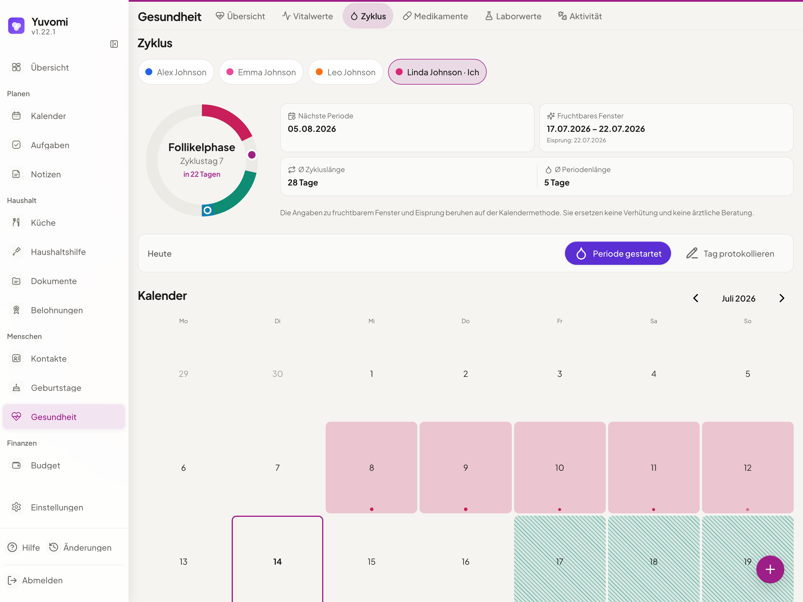
        </picture>
        <br><sub><b>Gesundheit</b> - Vitalwerte, Medikamente, Laborwerte, Aktivität &amp; Zyklus-Tracking, je Mitglied</sub>
      </td>
      <td align="center" width="50%">
        <picture>
          <source media="(prefers-color-scheme: dark)" srcset="docs/screenshots/de/rewards-dark-web.png">
          <source media="(prefers-color-scheme: light)" srcset="docs/screenshots/de/rewards-light-web.png">
          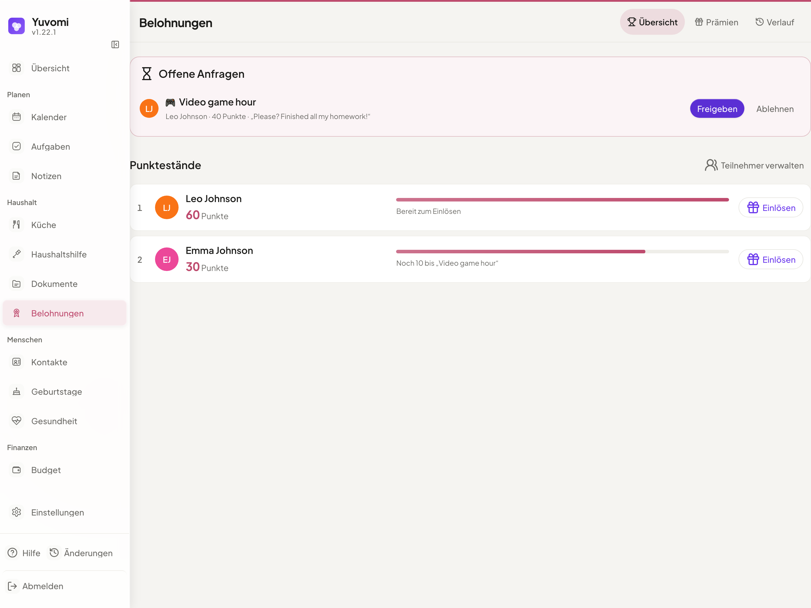
        </picture>
        <br><sub><b>Belohnungen</b> - Punkte für Aufgaben, elterlich freigegebener Katalog &amp; Punktekonto</sub>
      </td>
    </tr>
    <tr>
      <td align="center">
        <picture>
          <source media="(prefers-color-scheme: dark)" srcset="docs/screenshots/de/split-expenses-dark-web.png">
          <source media="(prefers-color-scheme: light)" srcset="docs/screenshots/de/split-expenses-light-web.png">
          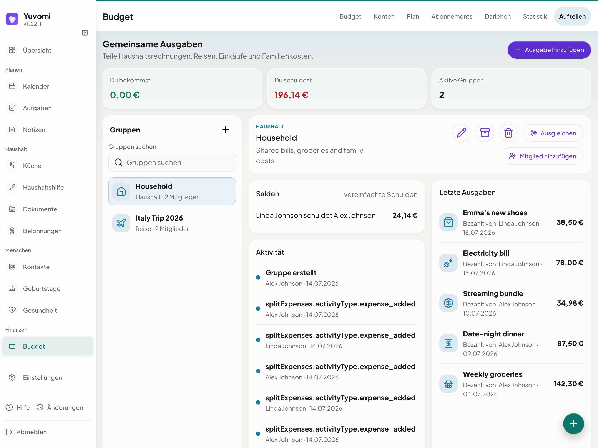
        </picture>
        <br><sub><b>Geteilte Ausgaben</b> - Gemeinsame Kosten mit automatischer Schuldenvereinfachung</sub>
      </td>
      <td align="center">
        <picture>
          <source media="(prefers-color-scheme: dark)" srcset="docs/screenshots/de/budget-dark-web.png">
          <source media="(prefers-color-scheme: light)" srcset="docs/screenshots/de/budget-light-web.png">
          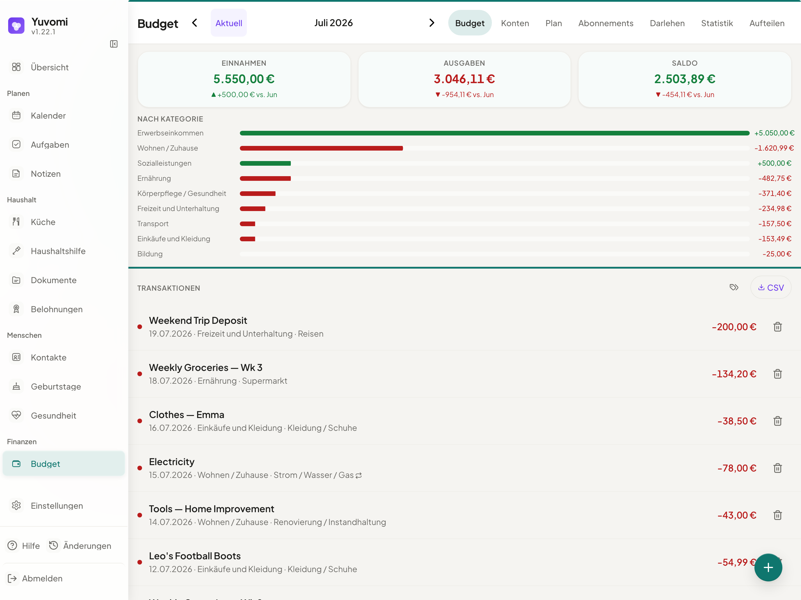
        </picture>
        <br><sub><b>Budget</b> - Einnahmen, Ausgaben, Abos, CSV-Export</sub>
      </td>
    </tr>
    <tr>
      <td align="center">
        <picture>
          <source media="(prefers-color-scheme: dark)" srcset="docs/screenshots/de/tasks-dark-web.png">
          <source media="(prefers-color-scheme: light)" srcset="docs/screenshots/de/tasks-light-web.png">
          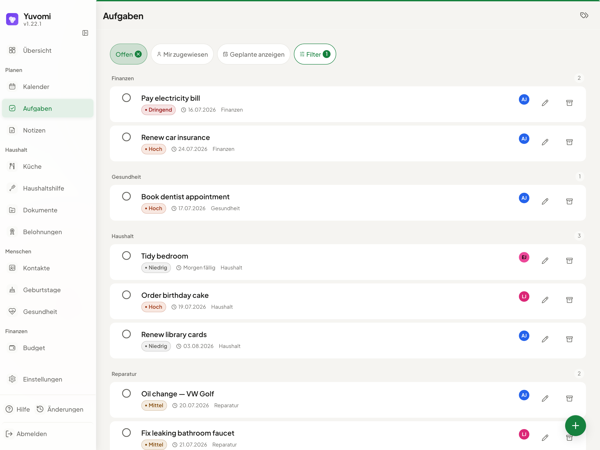
        </picture>
        <br><sub><b>Aufgaben</b> - Kanban-Board, wiederkehrende Termine, Mehrfachzuweisung</sub>
      </td>
      <td align="center">
        <picture>
          <source media="(prefers-color-scheme: dark)" srcset="docs/screenshots/de/calendar-dark-web.png">
          <source media="(prefers-color-scheme: light)" srcset="docs/screenshots/de/calendar-light-web.png">
          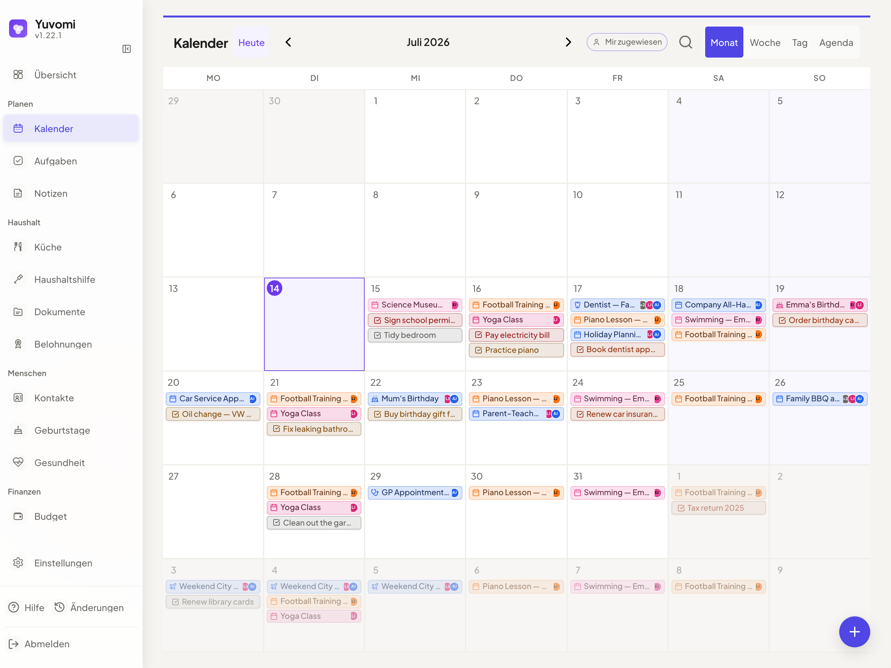
        </picture>
        <br><sub><b>Kalender</b> - Google-OAuth, iCloud, CalDAV, ICS-Abos &amp; -Import</sub>
      </td>
    </tr>
    <tr>
      <td align="center">
        <picture>
          <source media="(prefers-color-scheme: dark)" srcset="docs/screenshots/de/meals-dark-web.png">
          <source media="(prefers-color-scheme: light)" srcset="docs/screenshots/de/meals-light-web.png">
          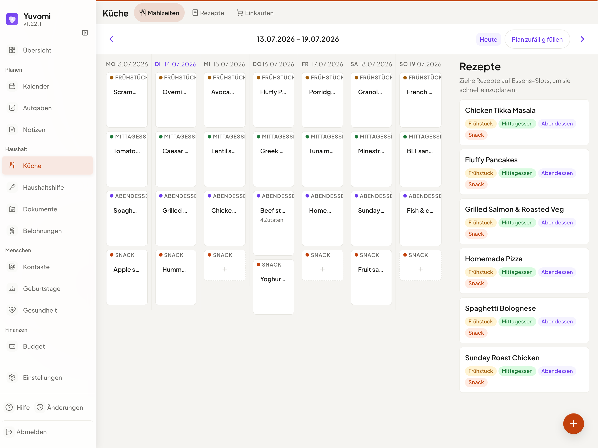
        </picture>
        <br><sub><b>Mahlzeiten</b> - Wochenplaner, Rezepte, Ein-Klick-Einkaufsexport</sub>
      </td>
      <td align="center">
        <picture>
          <source media="(prefers-color-scheme: dark)" srcset="docs/screenshots/de/shopping-dark-web.png">
          <source media="(prefers-color-scheme: light)" srcset="docs/screenshots/de/shopping-light-web.png">
          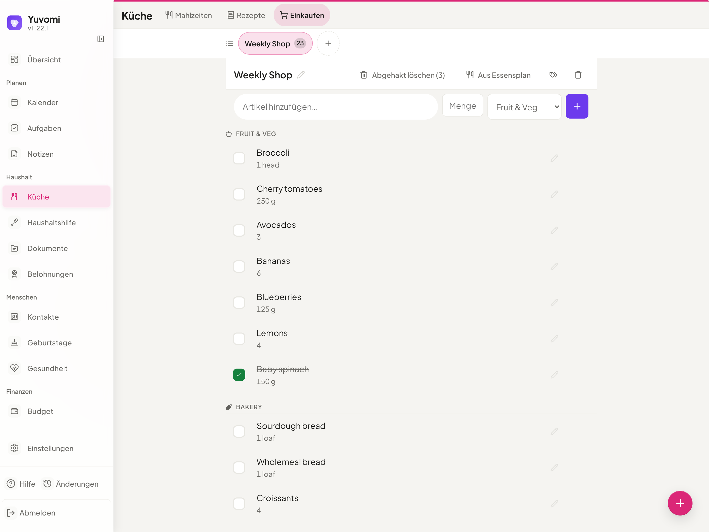
        </picture>
        <br><sub><b>Einkauf</b> - Geteilte Listen, Gang-Gruppen, Wischgesten</sub>
      </td>
    </tr>
  </table>

  <sub>Auch mobil - jedes Modul passt sich an Smartphone-Bildschirme an:</sub>
  <br>
  <picture>
    <source media="(prefers-color-scheme: dark)" srcset="docs/screenshots/de/health-cycle-dark-mobile.png">
    <source media="(prefers-color-scheme: light)" srcset="docs/screenshots/de/health-cycle-light-mobile.png">
    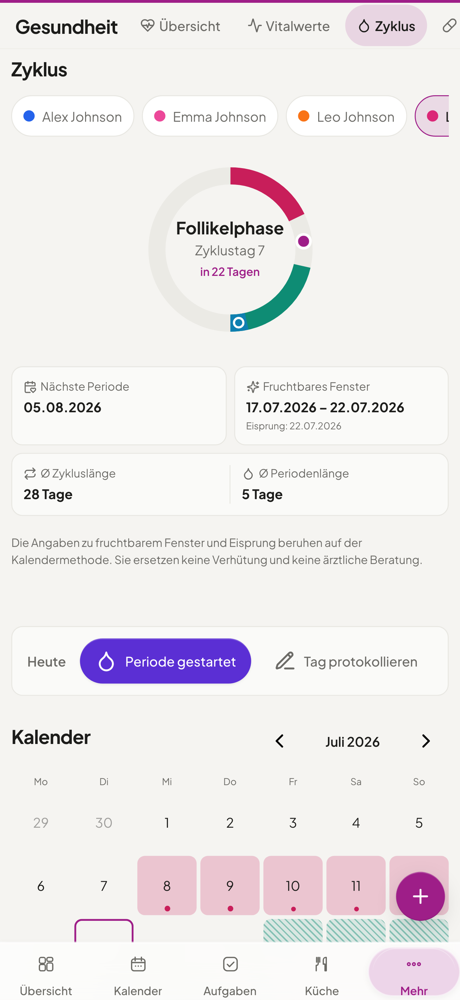
  </picture>
  &nbsp;
  <picture>
    <source media="(prefers-color-scheme: dark)" srcset="docs/screenshots/de/rewards-dark-mobile.png">
    <source media="(prefers-color-scheme: light)" srcset="docs/screenshots/de/rewards-light-mobile.png">
    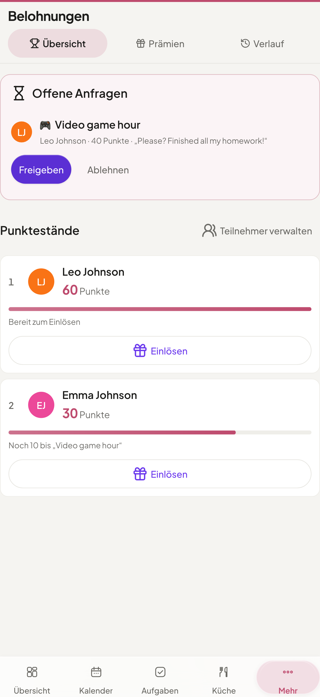
  </picture>
  &nbsp;
  <picture>
    <source media="(prefers-color-scheme: dark)" srcset="docs/screenshots/de/tasks-dark-mobile.png">
    <source media="(prefers-color-scheme: light)" srcset="docs/screenshots/de/tasks-light-mobile.png">
    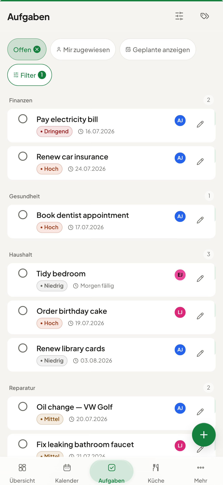
  </picture>
  &nbsp;
  <picture>
    <source media="(prefers-color-scheme: dark)" srcset="docs/screenshots/de/calendar-dark-mobile.png">
    <source media="(prefers-color-scheme: light)" srcset="docs/screenshots/de/calendar-light-mobile.png">
    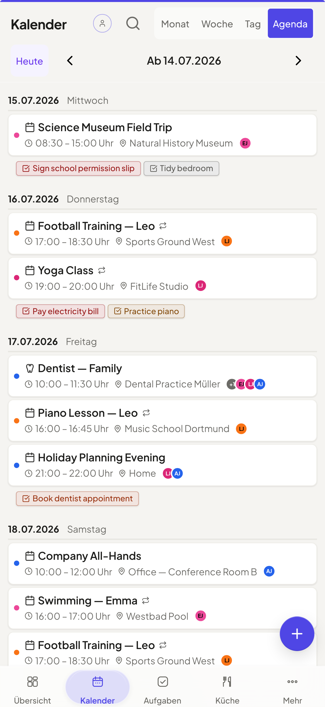
  </picture>

  <br><br>
  <a href="https://yuvomi.cloud/">Alle Screenshots auf yuvomi.cloud →</a>
</div>

---

## Module

Siebzehn eigenständige Module teilen sich eine ruhige, konsistente Oberfläche. Schalte ein, was dein Haushalt braucht; der Rest bleibt aus dem Weg.

| | Modul | In einem Satz |
|:---:|---|---|
|  | **Aufgaben** | Kanban-Board mit Fristen, Prioritäten, Teilaufgaben, Tags, wiederkehrenden Terminen und Zuweisung an mehrere Mitglieder. |
|  | **Einkauf** | Gemeinsame, nach Gang gruppierte Listen mit Wischgesten und Ein-Tipp-Import aus dem Mahlzeitenplan. |
|  | **Mahlzeiten** | Wochenplaner mit Drag-and-drop-Rezept-Seitenleiste und direktem Export in die Einkaufsliste. |
|  | **Rezepte** | Rezepte erstellen, duplizieren und skalieren, dann Mahlzeiten-Slots vorbefüllen, die Zutaten direkt auf eine Einkaufsliste schicken oder jede geplante Mahlzeit speichern. Spiegelt auf Wunsch eine selbst gehostete Mealie-Instanz, nur lesend. |
|  | **Vorrat** | Was tatsächlich im Haus ist: Menge, Lagerort und Mindesthaltbarkeitsdatum, mit Ablauf- und Mindestbestand-Filtern und einer Übergabe in beide Richtungen mit der Einkaufsliste. |
|  | **Kalender** | Zweiwege-Sync mit Google und CalDAV, ICS-Abos, wiederkehrende Termine, Feiertags-Overlays und geteilte Sichtbarkeit. |
|  | **Dokumente** | Familiendateien hochladen, taggen, vorschauen und organisieren, mit optionalem WebDAV- oder Google-Drive-Speicher. |
|  | **Budget** | Einnahmen, Ausgaben, Konten, Kredite, Abos und Planung je Kategorie, mit persönlichem Modus. |
|  | **Haushaltshilfe** | Personal verwalten: Dienstpläne, Ein-/Auschecken, Tages- oder Stundenabrechnung, Aufgaben und Materialanforderungen. |
|  | **Belohnungen** | Punkte auf Aufgaben schreiben zugewiesenen Mitgliedern gut, mit einstellbarem Standardwert für neue Aufgaben, elterlich freigegebenem Katalog und prüfbarem Punktekonto. |
|  | **Gesundheit** | Vitalwerte, Medikamente, Laborwerte, Aktivität und Zyklus-Tracking je Mitglied, mit Trend-Charts. |
|  | **Notizen &amp; Kontakte** | Bunte Markdown-Notizzettel plus ein Kontaktverzeichnis mit CardDAV-Sync und vCard-Import/-Export. |
|  | **Geburtstage** | Geburtstags-Tracker mit automatischen Kalenderterminen, Altersanzeige und Erinnerungen. |
|  | **Familie** | Mitgliederprofile mit Rollen, Fotos und Kontaktdaten, synchronisiert mit Kontakten und Geburtstagen. Neue Mitglieder kommen über einen Einladungslink dazu und wählen ihr Passwort selbst. |
|  | **Erinnerungen** | Erinnerungen zu Aufgaben und Terminen per In-App-Badge, Opt-in-Web-Push und Haushalts-Kanälen über Gotify/ntfy. |
|  | **API-Tokens** | Bearer-/X-API-Key-Tokens mit OpenAPI-3.0-Spec und eingebautem MCP-Endpunkt für KI-Agenten. |
|  | **Backup** | Manuelles und geplantes Datenbank-Backup/-Restore mit Rollback vor dem Zurückspielen und optionalem WebDAV-Upload. |

<details>
<summary><b>Alles sehen, was jedes Modul kann →</b></summary>

<br>

- **Aufgaben** - Fristen, Prioritäten, Teilaufgaben, wiederkehrende Termine, Zuweisung an mehrere Mitglieder, Sichtbarkeit je Aufgabe (nur ich / Zugewiesene / alle), anpassbare Kategorien, freie Tags, verknüpfte Dokumente aus dem Dokumente-Modul, ein „Mir zugewiesen"-Filter, Stichwortsuche über Titel, Beschreibung und Tags und ein Kanban-Board. Eine wiederkehrende Aufgabe kann ihr Intervall ab dem Tag zählen, an dem du sie abhakst, statt ab dem Fälligkeitsdatum - für alles, dessen Rhythmus mit der Handlung beginnt und nicht mit dem Kalender. Antippen öffnet eine Leseansicht statt des Formulars, damit die Tastatur unten bleibt, wenn man nur nachsehen wollte; Bearbeiten ist ein eigener Schritt, und der Status lässt sich direkt aus der Leseansicht weiterschalten. Eine Aufgabe liegt in genau einer Kategorie, trägt aber beliebig viele Tags: ein Klick auf ein Tag filtert danach, mehrere engen die Liste ein, ein Tag lässt sich haushaltsweit umbenennen oder mit einem anderen zusammenführen, und für eine ganze Auswahl auf einmal vergeben oder entfernen. Optionaler Zwei-Wege-CalDAV-Sync mit Erinnerungslisten (Apple Erinnerungen, Radicale, Nextcloud): Abhaken, Bearbeiten und Löschen einer gespiegelten Aufgabe kommen auf dem Server an, und die Tags reisen als Kategorien der Liste in beide Richtungen mit.
- **Einkauf** - Gemeinsame, nach Gang gruppierte Listen mit Wischgesten, Notizen je Artikel, Ein-Tipp-Import aus dem Mahlzeitenplan und der Übernahme aller abgehakten Artikel in den Vorrat. Artikel aus einer CalDAV-Erinnerungsliste zeigen deren Kategorien als Tags.
- **Mahlzeiten** - Wochenplaner mit mehreren Einträgen pro Slot, wöchentlicher Wiederholung, einer Drag-and-drop-Rezept-Seitenleiste, einem Ein-Klick-Wochen-Zufallsgenerator und direktem Export in die Einkaufsliste.
- **Rezepte** - Rezepte erstellen, duplizieren und skalieren; Mahlzeiten-Slots vorbefüllen, die Zutaten direkt auf eine Einkaufsliste schicken oder jede geplante Mahlzeit als Rezept speichern. Spiegelt auf Wunsch eine selbst gehostete Mealie-Instanz: deren Rezepte erscheinen neben deinen eigenen mit Quellen-Badge und Rücklink, du planst und kaufst mit ihnen ein wie mit jedem anderen Rezept, und Mealie bleibt die Quelle der Wahrheit für ihren Inhalt - dupliziere eines, um eine bearbeitbare Kopie zu bekommen.
- **Vorrat** - Was tatsächlich im Haus ist, als vierte Seite der Küche: Menge und Einheit, Lagerort, Mindesthaltbarkeitsdatum, optionaler Mindestbestand und Notiz. Ein Mengen-Stepper bucht mit einem Tipp ein und aus, Status-Badges erscheinen nur dort, wo sie etwas bedeuten (abgelaufen, läuft binnen einer Woche ab, fast leer, leer), und Filter zeigen genau diese Artikel. Lagerorte lassen sich umbenennen und sortieren; einen zu löschen erhält den Bestand. Läuft in beide Richtungen mit der Einkaufsliste: leere oder knappe Artikel wandern einzeln oder gesammelt auf die Liste (aufgefüllt bis zum Mindestbestand), und alles nach dem Einkauf Abgehakte lässt sich mit Menge und Einheit in den Vorrat buchen.
- **Kalender** - Zweiwege-Sync mit Google (OAuth) und CalDAV (iCloud, Nextcloud, Radicale) - Anlegen, Bearbeiten, Löschen und das Verschieben in einen anderen Kalender kommen auf dem Server an -, ICS-Abos, einmaliger Import aus einer `.ics`-Datei oder einem geteilten Feed als bearbeitbare lokale Termine, wiederkehrende Termine mit Scope je Vorkommen (nur diesen Termin, diesen und folgende oder die ganze Serie bearbeiten oder löschen), Anhänge, Feiertags-Overlays, Stichwortsuche über Titel, Ort und Notizen (akzentunabhängig), ein „Mir zugewiesen"-Filter, Sichtbarkeit je Termin, eine Standard-Zuweisung je synchronisiertem Kalender, zugewiesene Mitglieder als Avatare, ein wählbarer Wochenstart (Montag, Sonntag oder Samstag) und ein schreibgeschützter `webcal://`-Export-Feed, der die zugewiesenen Mitglieder optional im Termintitel zeigen kann. Antippen öffnet zuerst eine Leseansicht, die auch Wiederholung im Klartext, Erinnerungen und Sichtbarkeit nennt; Bearbeiten ist ein eigener Schritt.
- **Dokumente** - Familiendateien hochladen, taggen, vorschauen und organisieren, mit Sichtbarkeit je Dokument. Mehrfach-Upload, Ordner, Sortierung, Kategorie-Facetten mit Trefferzahlen sowie Verschieben/Archivieren/Löschen in Stapeln. Optionaler lokaler Ordner-, WebDAV- oder Google-Drive-Speicher sowie Paperless-ngx- und Papra-(DMS-)Anbindung.
- **Budget** - Einnahmen, Ausgaben, wiederkehrende Buchungen in jedem Rhythmus (wöchentlich, monatlich oder jährlich, alle N davon - also auch alle zwei Wochen oder alle drei Monate statt nur drei fester Intervalle), auf Wunsch erst nach deiner Bestätigung gebucht, wobei sich Betrag und Datum dabei korrigieren lassen, weil nicht jeder Dienst am selben Tag und auf den Cent genau abbucht, Trend-Charts, ein Statistik-Tab, CSV-Export, Konten mit Startsaldo und laufendem Kontostand samt Nettovermögen, Kredite in beide Richtungen (verliehenes Geld zählt als Einnahme, wenn es zurückkommt, ein aufgenommener Kredit als Ausgabe, wenn du ihn abbezahlst, und jeder kann ein Konto belasten; optional als Annuitätendarlehen mit festem, variablem oder fest-dann-variablem Zins, Rate, Laufzeit und Gesamtzins werden live berechnet; jedes Darlehen kann in einer eigenen Währung mit festem Umrechnungskurs in die Budget-Währung laufen), geteilte Ausgaben, Abo-Tracking mit Verlängerungen, Währungen und optionalem Enddatum (an einem Datum oder nach N Zahlungen, danach automatisch abgeschlossen), ein Plan-Tab mit monatlichen Kategorie-Budgets und einem Sparziel (Soll vs. Ist), Belege an Buchungen und geteilten Ausgaben (vorhandenes Dokument verknüpfen oder neue Datei hochladen, mehrere je Buchung) sowie ein optionaler persönlicher Budget-Modus, in dem jeder Eintrag privat oder geteilt sein kann, mit Mein-Budget/Haushalt-Ansicht.
- **Haushaltshilfe** - Personal verwalten: Dienstpläne, Ein-/Auschecken, Tages- oder Stundenabrechnung, Aufgaben und Materialanforderungen.
- **Belohnungen** - Punktwerte auf Aufgaben schreiben zugewiesenen Mitgliedern gut; ein optionaler Haushalts-Standard befüllt neue Aufgaben vor und lässt sich bei Änderung auf unerledigte ausrollen; ein Belohnungskatalog mit elterlich freigegebenen Einlösungen, Opt-in je Mitglied und ein prüfbares Punktekonto.
- **Gesundheit** - Vitalwerte je Mitglied (Blutdruck, Blutzucker, Gewicht, Sauerstoffsättigung, Temperatur, Schlafdauer in Stunden und Minuten sowie Stimmung auf einer fünfstufigen Skala), Medikamente mit Nachfüll-Warnungen, Laborwerte, Aktivitätsprotokolle und Zyklus-Tracking (Perioden-Vorhersagen, fruchtbares Fenster, Zyklus-Ring, Schwangerschafts-Modus), mit Trend-Charts, CSV-Export und Sichtbarkeit je Eintrag. Ein Admin kann festlegen, dass ein Mitglied für ein anderes einträgt, damit Eltern Fieber und Medikamente ihres Kindes erfassen; das Zyklus-Tagebuch bleibt davon ausgenommen.
- **Notizen &amp; Kontakte** - Bunte Markdown-Notizzettel, die gerendert im Lesemodus öffnen (Umschalter zum Bearbeiten), mit Volltextsuche, Filter nach Ersteller und vorangestellten angepinnten Notizen, plus ein Kontaktverzeichnis mit CardDAV-Sync und vCard-Import/-Export mehrerer Kontakte. Kontakte folgen derselben Grammatik: Antippen zeigt den Eintrag, bevor es ihn ändern lässt, mit jeder gespeicherten Nummer, Mail und Adresse als eigener Trefferfläche - die Liste bot immer nur die erste davon - und Bearbeiten als eigenem Schritt.
- **Geburtstage** - Geburtstags-Tracker mit automatischen Kalenderterminen, Altersanzeige, eigenen Erinnerungen und selektivem Import aus synchronisierten Kontakten.
- **Familie** - Mitgliederprofile mit Rollen, Fotos und Kontaktdaten, synchronisiert mit Kontakten und Geburtstagen.
- **Erinnerungen** - Erinnerungen zu Aufgaben und Terminen per In-App-Badge, Opt-in-Web-Push (HTTPS) und Haushalts-Kanälen über Gotify/ntfy.
- **API-Tokens** - Bearer-/X-API-Key-Tokens mit OpenAPI-3.0-Spec und eingebautem MCP-Endpunkt (`/mcp`), über den KI-Agenten wie Claude Desktop die gesamte API in natürlicher Sprache steuern. Optionale Modul-Scopes (Lesen/Schreiben) halten ein Token - etwa eines für einen KI-Client - von sensiblen Bereichen fern.
- **Backup** - Manuelles und geplantes Datenbank-Backup/-Restore mit automatischem Rollback vor dem Zurückspielen. Optionales WebDAV-Upload-Ziel (Nextcloud, ownCloud usw.).

</details>

<sub>Vollständiges Datenmodell und Modul-Details in der <a href="docs/SPEC.md">Spec</a> und der <a href="MODULES.md">Modul-Referenz</a>.</sub>

<details>
<summary><b>Hinweise zum Selbsthosten &amp; Sicherheit</b> - lesenswert, bevor du live gehst</summary>

<br>

> **Gesundheit ist kein Medizinprodukt.** Keine diagnostischen Aussagen. Gesundheitsdaten sind sensibel; aktiviere die Datenbankverschlüsselung (`DB_ENCRYPTION_KEY`, SQLCipher).

> **Externer Dokumentenspeicher braucht ein eigenes Backup.** Datenbank-Backups enthalten Metadaten und Verweise, nicht die Binärdateien in einem lokalen Ordner, auf WebDAV oder in Google Drive. Sichere das gewählte Ziel separat. Yuvomis Sichtbarkeitseinstellungen steuern nur den Zugriff über Yuvomi. Alle Personen mit Zugriff auf den verbundenen Google-Drive-Ordner `Yuvomi/Documents` können sämtliche dort gespeicherten Dateien sehen. WebDAV-Ziele aus der Admin-Oberfläche müssen zu öffentlichen Adressen auflösen; für ein vertrauenswürdiges LAN- oder Loopback-Ziel setze `DOCUMENT_STORAGE_WEBDAV_URL` über die Deployment-Umgebung oder `DOCUMENT_STORAGE_WEBDAV_ALLOW_PRIVATE_NETWORK=true`, um private Ziele auch aus der UI zuzulassen.

> **Interne Ziele (LAN / private IP) sind standardmäßig blockiert.** Der SSRF-Schutz weist private, Loopback-, Link-local- und interne-DNS-URLs für ICS-Kalenderabos, WebDAV-Dokumentenspeicher und Rezept-Provider-Spiegel ab. Um eine intern auflösende URL zu nutzen, setze das passende Opt-in in deiner Deployment-Umgebung: `ICS_SUBSCRIPTION_ALLOW_PRIVATE_NETWORK=true` für Kalender-Feeds, `DOCUMENT_STORAGE_WEBDAV_ALLOW_PRIVATE_NETWORK=true` für den Dokumentenspeicher, `RECIPE_PROVIDER_ALLOW_PRIVATE_NETWORK=true` für Rezept-Provider-Spiegel. Siehe die [Installationsanleitung](docs/installation.md#environment-variables).

</details>

---

## Überall installieren

### Web-Installer (empfohlen)

Ein lokalisierter Setup-Assistent, in 24 Sprachen, der im Browser läuft. Erkennt Docker oder Podman automatisch, konfiguriert HTTPS, SSO und geplante Backups, startet dann den Container und legt dein Admin-Konto an.

```bash
git clone https://github.com/ulsklyc/yuvomi.git && cd yuvomi
node tools/installer/install-server.js
```

Öffne **http://localhost:8090**. Benötigt Node.js 18+ auf dem Host für den Installer; der App-Container bringt sein eigenes Node 22 mit.

### Docker / Podman

**Vorgefertigtes Image:**

```bash
curl -O https://raw.githubusercontent.com/ulsklyc/yuvomi/main/docker-compose.yml
curl -O https://raw.githubusercontent.com/ulsklyc/yuvomi/main/.env.example
cp .env.example .env          # SESSION_SECRET und DB_ENCRYPTION_KEY setzen
docker compose up -d
```

**Aus dem Quellcode bauen:**

```bash
git clone https://github.com/ulsklyc/yuvomi.git && cd yuvomi
cp .env.example .env
docker compose up -d --build
```

Öffne `http://localhost:3000`. Der erste Besuch führt dich durch die Anlage deines Admin-Kontos.

> **Podman (RHEL / Fedora / CentOS Stream):** Beide Installer erkennen Podman automatisch und nutzen `podman-compose.yml` mit SELinux-`:Z`-Labels. Für einen manuellen Start: `podman compose -f podman-compose.yml up -d`. Rootless-systemd-Autostart: `tools/quadlet/oikos.container`.

### NAS &amp; Home-Server

<table>
  <tr>
    <td><b>TrueNAS SCALE</b></td>
    <td>Apps → Discover Apps → nach <b>Yuvomi</b> suchen → Install</td>
    <td>Kein Terminal nötig. Community-Apps-Katalog. Versions-Updates via Renovate.</td>
  </tr>
  <tr>
    <td><b>Umbrel</b></td>
    <td>App Store → nach <b>Yuvomi</b> suchen → Install</td>
    <td>Ein-Klick-Installation. Alles bleibt auf deinem Umbrel.</td>
  </tr>
  <tr>
    <td><b>Unraid</b></td>
    <td>Apps → nach <b>Yuvomi</b> suchen → Apply</td>
    <td>Community-Applications-Template. <code>SESSION_SECRET</code> bei der Installation setzen.</td>
  </tr>
</table>

> **Neu bei Docker oder Podman?** Der **[Installations-Leitfaden](docs/installation.md)** deckt Engine-Setup, HTTPS/Reverse-Proxy, Backups und Troubleshooting Schritt für Schritt ab.

> **Einige Katalog-Slugs tragen noch den alten Namen `oikos`** (z. B. Unraid `oikos-…`). TrueNAS ist vollständig zu `community/yuvomi` umbenannt - der alte Eintrag bleibt als *Oikos (Deprecated)* für Bestandsinstallationen eingefroren. Die App zeigt und installiert sich überall als **Yuvomi**; wo der technische Slug `oikos` bleibt, sichert das bestehenden Installationen (Datenbankpfade und Containernamen) ein nahtloses Update. Suche nach **Yuvomi**; taucht ein Store einen Eintrag noch als *oikos* auf, ist es dieselbe App.

---

## FAQ

<details>
<summary><b>Muss ich technisch versiert sein, um das zu betreiben?</b></summary>
<br>
Wenn du eine App auf einem NAS installieren oder einen einzelnen Befehl ausführen kannst, reicht das. Der Web-Installer spricht 24 Sprachen, erkennt Docker oder Podman automatisch und richtet HTTPS, SSO und Backups für dich ein. Auf TrueNAS, Umbrel und Unraid installierst du aus dem App-Store, ganz ohne Terminal.
</details>

<details>
<summary><b>Funktioniert es auf meinem Smartphone?</b></summary>
<br>
Yuvomi ist eine mobile-first PWA. Auf den Homescreen installiert fühlt sie sich nativ an, mit optimierten Touch-Zielen und einer persistenten unteren Leiste. Sie funktioniert auch offline, mit Lesezugriff auf zuletzt gesehene Kalender-, Aufgaben-, Einkaufs-, Kontakt- und Dashboard-Daten.
</details>

<details>
<summary><b>Wo liegen meine Daten, und wer kann sie sehen?</b></summary>
<br>
Alles bleibt auf deinem Server. Es gibt keinerlei Telemetrie und keine Tracker. Du kannst die SQLCipher-AES-256-Datenbankverschlüsselung einschalten (im empfohlenen Docker-Setup ist sie aktiv), und die Sichtbarkeit je Eintrag hält private Einträge privat, während geteilte im Haushalt geteilt bleiben.
</details>

<details>
<summary><b>Wie funktionieren Updates und Backups?</b></summary>
<br>
Aktualisiere, indem du das neue Image ziehst (`docker compose pull && docker compose up -d`); auf TrueNAS übernimmt das Renovate. Bestehende Daten und Einstellungen bleiben beim Upgrade erhalten. Backups laufen manuell oder nach Zeitplan, mit Rollback vor dem Zurückspielen und optionalem WebDAV-Upload. Beachte: Dateien in externem Dokumentenspeicher brauchen ein eigenes Backup.
</details>

<details>
<summary><b>Kann die ganze Familie es nutzen, nicht nur ich?</b></summary>
<br>
Ja. Jedes Haushaltsmitglied ist ein vollwertiger Nutzer mit eigenem Profil, eigener Rolle und eigenem Avatar. Du lädst sie per Link ein und sie wählen ihr Passwort selbst, sodass kein Admin je eines weitergeben muss. Optionales SSO (jeder OIDC-Provider) und Self-Service-Passwort-Reset per E-Mail halten die Anmeldung für alle unkompliziert.
</details>

<details>
<summary><b>Was kostet es?</b></summary>
<br>
Nichts. Yuvomi ist kostenlos und MIT-lizenziert. Du stellst den Server; es gibt kein Abo, kein Upselling und keine Bezahlstufe.
</details>

---

## Unter der Haube

- **Disziplinierte Liquid-Glass-UI** - lesbare Arbeitsflächen, dezent transluzente Navigation, Spring-Animationen und modul-getönte Overlays, in reinem CSS gebaut, ohne Framework.
- **Kein Build-Schritt** - reine ES-Module, kein Bundler, kein Transpiler, kein Framework.
- **Datenschutz zuerst** - vollständig selbstgehostet, optionale SQLCipher-AES-256-Datenbankverschlüsselung, keine Telemetrie.
- **SSO / OpenID Connect** - optionales Single Sign-on über jeden OIDC-Provider (Authentik, Keycloak, Google, Microsoft Entra), konfiguriert mit vier Umgebungsvariablen; Authorization-Code- + PKCE-Flow.
- **Einladungslinks** - Admins laden neue Mitglieder per Link ein, statt ihnen ein Passwort zu setzen; die eingeladene Person legt es selbst fest, der Link läuft nach 7 Tagen ab. Der Mailversand ist optional, der Link funktioniert auch ohne SMTP.
- **Self-Service-Passwort-Reset** - optionales SMTP lässt Nutzer ein vergessenes Passwort selbst per zeitlich begrenztem E-Mail-Link zurücksetzen; enumerationssicher by design.
- **Mehrsprachig** - 24 Sprachen mit automatischer Locale-Erkennung (de, en, es, fr, it, sv, el, ru, tr, zh, ja, ar, hi, pt, uk, pl, nl, cs, vi, hu, ko, id, fa, fil). Eine eigene Haushalts-Einstellung bestimmt die Sprache selbst erzeugter Einträge, damit ein exportierter Kalender und die API die Sprache des Haushalts sprechen statt Englisch.

<p>
  
  
  
  
  
  
  
  
</p>

---

## Dokumentation

[Installation](docs/installation.md) &nbsp;·&nbsp; [Spec &amp; Datenmodell](docs/SPEC.md) &nbsp;·&nbsp; [Module](MODULES.md) &nbsp;·&nbsp; [Mitwirken](CONTRIBUTING.md) &nbsp;·&nbsp; [Sicherheit](SECURITY.md) &nbsp;·&nbsp; [Datenschutz für Selbsthoster](docs/PRIVACY-FOR-SELFHOSTERS.md) &nbsp;·&nbsp; [Changelog](CHANGELOG.md) &nbsp;·&nbsp; [Backlog](BACKLOG.md)

Wenn du Yuvomi in einem DSGVO-Kontext selbst hostest (EU/EWR, Verarbeitung fremder Daten), lies [docs/PRIVACY-FOR-SELFHOSTERS.md](docs/PRIVACY-FOR-SELFHOSTERS.md) vor dem Produktivbetrieb: Es behandelt Drittland-Bewertungen für jeden externen Dienst (Wetter, CalDAV/CardDAV, OIDC, WebDAV-Backup und Dokumentenspeicher), Hinweise zu Auftragsverarbeitungsverträgen, Empfehlungen zur Log-Aufbewahrung und eine Vorlage für das Verzeichnis von Verarbeitungstätigkeiten.

<details>
<summary>Kommst du von <b>Oikos</b>? Das Projekt wurde umbenannt - an der App ändert sich nichts.</summary>

<br>

Yuvomi wurde von **Oikos** umbenannt, um einen Markenkonflikt mit einem unabhängigen Produkt zu vermeiden. Gleicher Code, gleiche Daten, gleicher Maintainer.

- Alte Links (`github.com/ulsklyc/oikos`) leiten automatisch hierher weiter.
- Das Docker-Image liegt jetzt unter `ghcr.io/ulsklyc/yuvomi`; das alte `ghcr.io/ulsklyc/oikos` funktioniert weiterhin, du kannst also in Ruhe umstellen.
- Bestehende Daten und Einstellungen bleiben beim Upgrade vollständig erhalten.

Neues Zuhause: **https://yuvomi.cloud/** · Fragen? Eröffne eine [Diskussion](https://github.com/ulsklyc/yuvomi/discussions).

</details>

---

## Lizenz

MIT, siehe [LICENSE](LICENSE).

<div align="center">
  <br>
  <sub>Mit Sorgfalt gebaut für Familien, die Privatsphäre und Einfachheit schätzen.</sub>
</div>
