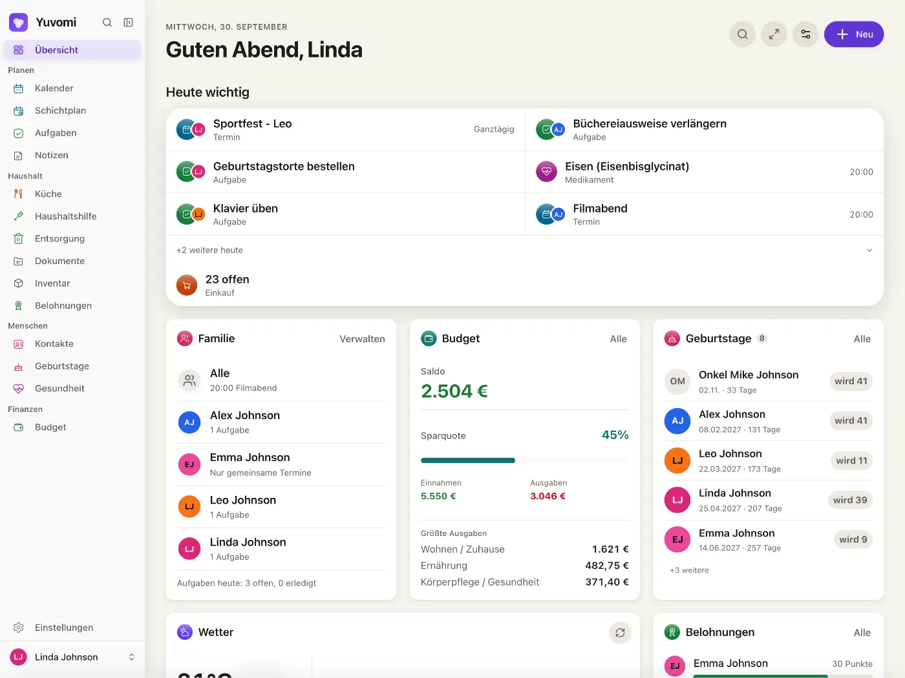
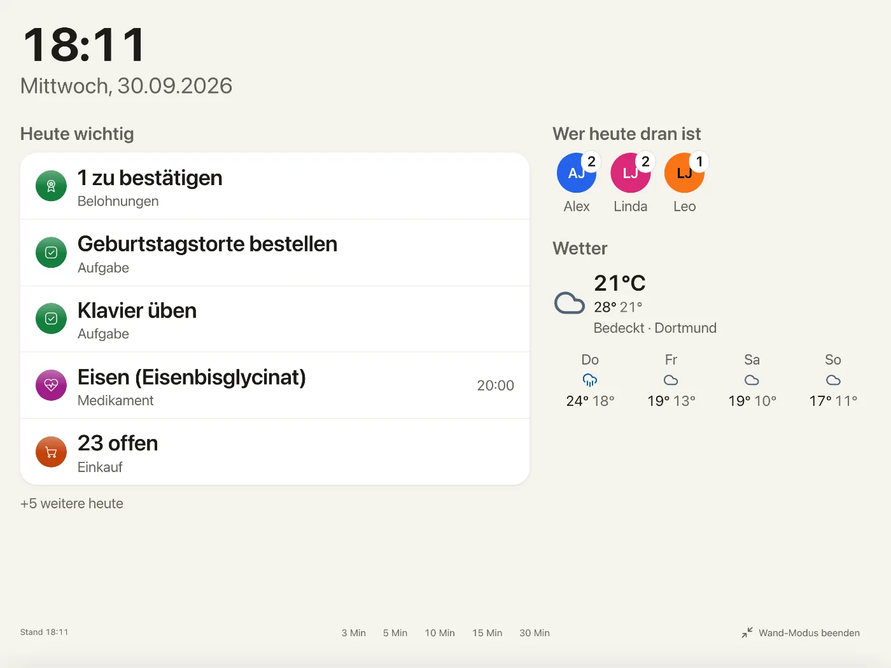

<div align="center">
  

  <h1>Yuvomi</h1>

  <p><strong>Der selbst gehostete Familienplaner.<br>Ein Zuhause statt vieler Abos.</strong></p>

  <p>
    Aufgaben, Kalender, Budget, Mahlzeiten, Gesundheit und mehr für eine Familie, ein Paar oder
    euch allein, auf einem Server, der euch gehört. Ab Werk verlässt ihn nur eine Versionsprüfung.
  </p>

  <p>
    <a href="https://github.com/ulsklyc/yuvomi/releases"></a>
    <a href="https://github.com/ulsklyc/yuvomi/stargazers"></a>
    <a href="https://github.com/ulsklyc/yuvomi/pkgs/container/yuvomi"></a>
    <a href="LICENSE"></a>
  </p>

  <p>
    <a href="https://yuvomi.cloud/"><strong>→ Rundgang auf yuvomi.cloud</strong></a>&nbsp;&nbsp;·&nbsp;
    <a href="#installieren"><strong>In&nbsp;Minuten&nbsp;installieren</strong></a>&nbsp;&nbsp;·&nbsp;
    <a href="#dokumentation"><strong>Doku</strong></a>&nbsp;&nbsp;·&nbsp;
    <a href="CHANGELOG.md"><strong>Changelog</strong></a>
  </p>

  <sub>Die englische Fassung (<a href="README.md">README.md</a>) ist die maßgebliche; diese Übersetzung folgt ihr.</sub>

  <picture>
    <source media="(prefers-color-scheme: dark)" srcset="docs/screenshots/de/dashboard-dark-web.webp">
    
  </picture>

  <sub><b>20</b> Module&nbsp;&nbsp;·&nbsp; <b>26</b> Sprachen&nbsp;&nbsp;·&nbsp; <b>0</b> Tracker&nbsp;&nbsp;·&nbsp; optionale&nbsp;<b>AES&#8209;256</b>&#8209;Datenbankverschlüsselung</sub>
</div>

Die meisten Haushalte kleben ihren Alltag aus einem Dutzend Bezahl-Apps zusammen, jede mit eigenem
Konto, eigenem Abo und einer eigenen Kopie eurer Daten auf fremden Servern. Yuvomi bringt das alles
an einen Ort, der euch gehört, als Container auf jedem Home-Server oder NAS.

---

## Viele Apps, ein Ort

| Statt zu jonglieren mit… | bekommt ihr mit Yuvomi |
|---|---|
| einer To-do- &amp; Aufgaben-App | **Aufgaben** - Kanban, Fristen, Wiederholungen, mehrere Zuständige |
| einer Familienkalender-App | **Kalender** - Sync, Abos, Sichtbarkeit je Termin |
| einer Essensplaner- &amp; Rezept-App | **Mahlzeiten &amp; Rezepte** - Wochenplaner mit Einkaufsexport |
| einer Einkaufslisten-App | **Einkauf** - geteilte, nach Gang sortierte Listen |
| einer App für Budget und Kostenteilen | **Budget** - Einnahmen, Ausgaben, Konten, Sparziele, geteilte Kosten mit vereinfachten Schulden |
| einer Dokumenten-App | **Dokumente** - durchsuchbare Familiendateien in Ordnern |

## Die Module reden miteinander

Das ist der Teil, den ein Ordner voller Einzel-Apps nicht kann:

- **Ein Import macht aus dem Wochenplan eine Einkaufsliste.** Die nächsten sieben Tage sind vorausgewählt, und jede Zutat landet nach Gang sortiert auf der gemeinsamen Liste.
- **Das letzte Glas aus dem Vorrat kommt mit einem Tipp auf die Liste.** Nach dem Einkauf bucht ein Knopf, was ihr abgehakt habt, mit Menge und Einheit zurück in den Vorrat.
- **Eine erledigte Aufgabe zahlt aus.** Punkte auf einer Aufgabe bekommt, wer sie erledigt hat - die zugewiesene Person oder die beim Abhaken ausgewählte -, und eingelöst werden sie in einem Belohnungskatalog, den ihr selbst bestimmt.
- **Ein abgelegter Beleg hängt an der Buchung.** Einmal hochgeladen, gehört er gleichzeitig zur Buchung, zur geteilten Ausgabe und zum Inventargegenstand.

## An der Küchenwand, in jeder Hosentasche

<div align="center">
  <picture>
    <source media="(prefers-color-scheme: dark)" srcset="docs/screenshots/de/dashboard-wall-dark-web.webp">
    
  </picture>
</div>

- **Das Tablet an der Küchenwand** zeigt im Wand-Modus den Tagesplan und wer heute dran ist, lesbar quer durch den Raum. Es hat ein eigenes Konto: Aufgabe antippen, auswählen, wer sie erledigt hat, und die Punkte gehen an diese Person. Steht es still, kann ein Immich-Bildschirmschoner eure eigenen Fotos zeigen.
- **Die App auf jedem Handy** kommt direkt aus dem Browser auf den Startbildschirm, ohne App Store. Erinnerungen kommen als Mitteilung, auch wenn die App zu ist (dafür braucht euer Server HTTPS), und die zuletzt geöffnete Einkaufsliste bleibt lesbar, wenn kein Netz da ist.
- **Jedes Mitglied kommt per Einladungslink** und wählt sein Passwort selbst; ein Kind ohne Handy bekommt sein Konto direkt angelegt. Je Familienrolle ist jedes Modul voll, nur lesen oder gar nicht freigegeben.

[Mehr auf yuvomi.cloud](https://yuvomi.cloud/#family)

## Die zwanzig Module

Schaltet ab, was euer Haushalt nicht braucht, und es verschwindet für alle aus dem Menü. Inventar,
Entsorgung und Schichtplan sind anfangs aus.

- **Planen** - Aufgaben · Kalender · Schichtplan · Notizen
- **Haushalt** - Mahlzeiten · Rezepte · Einkauf · Vorrat · Haushaltshilfe · Entsorgung · Dokumente · Inventar · Belohnungen
- **Menschen** - Gesundheit · Kontakte · Geburtstage
- **Finanzen** - Budget
- **Einstellungen** - Familie · Erinnerungen · API-Tokens · Backup

<details>
<summary><b>Jedes Modul in einer Zeile</b></summary>

| Modul | In einer Zeile |
|---|---|
| **Aufgaben** | Kanban-Board mit Fristen, Unteraufgaben, Wiederholungen, Kommentaren und einem Verlauf, wer was abgehakt hat. |
| **Einkauf** | Geteilte Listen nach Gang sortiert, mit Wischgesten und einem Import aus dem Essensplan. |
| **Mahlzeiten** | Wochenplaner per Drag-and-drop mit Rezept-Seitenleiste und direktem Export in die Einkaufsliste. |
| **Rezepte** | Rezepte anlegen und skalieren, Mahlzeiten vorbelegen oder eine Mealie- oder Tandoor-Instanz lesend spiegeln. |
| **Vorrat** | Menge, Lagerort und Mindesthaltbarkeit, mit einer Erinnerung, bevor etwas abläuft. |
| **Kalender** | Zwei-Wege-Sync mit Google und CalDAV, Outlook-Push, Kalender-Abos, Feiertage und Sichtbarkeit je Termin. |
| **Dokumente** | Durchsuchbare Familiendateien in Ordnern, lokal, auf WebDAV oder in Google Drive. |
| **Inventar** | Was ihr besitzt, mit Kaufpreis, Garantie, verknüpften Belegen, einem Wartungsprotokoll und wiederkehrenden Erinnerungen vor Fristablauf. Standardmäßig aus. |
| **Budget** | Einnahmen, Ausgaben, Konten, Darlehen, Abos und gemeinsame Ausgaben mit vereinfachten Schulden. |
| **Haushaltshilfe** | Für Hilfen im Haushalt: Dienstpläne, Ein- und Ausstempeln, Abrechnung, Aufgaben und Materialwünsche. |
| **Entsorgung** | Abholtermine je Abfallart, auch „der letzte Freitag", oder ein abonnierter kommunaler ICS-Kalender. Standardmäßig aus. |
| **Belohnungen** | Punkte aus Aufgaben, ein elterlich freigegebener Katalog, ein nachvollziehbares Konto und Taschengeld je Kind. |
| **Gesundheit** | Vitalwerte, Medikamente, Vorsorge, Laborwerte, Aktivität, Zyklus, ein Fastentagebuch und ein Ernährungstagebuch je Mitglied, mit Verlaufsdiagrammen. |
| **Schichtplan** | Rotierende Schichten und feste Wochenpläne, als Ebene im Kalender eingeblendet. Standardmäßig aus. |
| **Notizen &amp; Kontakte** | Markdown-Haftnotizen mit antippbaren Checklisten, dazu Kontakte mit CardDAV-Sync und vCard-Import/-Export. |
| **Geburtstage** | Geburtstage und optionale Namenstage, mit Kalendereinträgen, Alter und Erinnerungen. |
| **Familie** | Mitgliedsprofile mit Rollen und Einladungslinks, über die neue Mitglieder ihr Passwort selbst wählen. |
| **Erinnerungen** | An Aufgaben, Termine, Medikamente, Garantien, Mindesthaltbarkeit, ablaufende Dokumente und Abfuhr - in der App, per Push, Gotify, ntfy, Webhook oder E-Mail. |
| **API-Tokens** | Bearer-Tokens mit OpenAPI-3.1-Spezifikation und eingebautem MCP-Endpunkt für KI-Agenten. |
| **Backup** | Manuelle und geplante Sicherungen mit optionalem WebDAV-Upload und Rollback vor dem Wiederherstellen; auch das Backup einer anderen Installation spielt ihr direkt im Browser zurück. |

</details>

Jedes Modul im Detail steht in der [Spezifikation](docs/SPEC.md); wie ihr ein eigenes Modul
einhängt - mit eigenen Dashboard-Widgets, Rechten und Übersetzungen -, steht im [Modulhandbuch](MODULES.md).

---

## Bevor ihr euch festlegt

**Was, wenn dieses Projekt aufhört?** Auf eurer Maschine ändert sich nichts. Yuvomi ist
MIT-lizenziert und selbstgehostet, und auf dem Weg steht kein Server von uns. Der Container, den ihr
schon geholt habt, läuft weiter wie heute, mit uns oder ohne uns.

**Was, wenn ihr eure Daten woanders haben wollt?** Alles liegt in einer SQLite-Datei auf eurer
eigenen Platte, und sie zu kopieren ist der ganze Export, solange die Dokumente in der Datenbank
liegen. Geplante Backups schreiben zusätzlich ein wiederherstellbares Archiv, und die dokumentierte
API holt alles in der Form heraus, die ihr braucht.

**Wie sicher ist der Zugang von außen?** Jedes Konto kann einen zweiten Faktor bekommen (TOTP, mit
Wiederherstellungscodes), und ein Admin kann ihn für den ganzen Haushalt verlangen; neue Mitglieder
kommen per Einladungslink und wählen ihr Passwort selbst. Mit Single Sign-on über einen OIDC-Anbieter
lässt sich die Passwort-Anmeldung für den Haushalt abschalten, und ein verlorenes Handy meldet ihr
von jedem eurer anderen Geräte aus ab.

**Was kostet es?** Nichts. Yuvomi ist kostenlos und MIT-lizenziert. Ihr stellt den Server; es gibt
kein Abo, keinen Upsell und keine Bezahlstufe.

---

## Installieren

Sucht euch euren Weg aus: [Docker oder Podman](#docker-oder-podman) für volle Kontrolle, die
[geführte Einrichtung](#geführte-einrichtung) im Browser oder den
[App-Store eures NAS](#aus-dem-app-store-eures-nas) ganz ohne Terminal.

- **Image** - `ghcr.io/ulsklyc/`<wbr>`yuvomi:latest`, rund 500 MB, für amd64 und arm64 (Raspberry Pi 4/5).
- **Braucht** - 256 MB RAM und einen Port, standardmäßig 3000.
- **Schlüssel** - optional, aber ohne Weg zurück: ein verlorener oder geänderter Schlüssel öffnet die Datenbank nie wieder, weder für euch noch für uns. Die geführte Einrichtung und Umbrel erzeugen ihn für euch; mit Compose, TrueNAS oder Unraid setzt ihr ihn selbst, also schreibt ihn auf.

<details>
<summary><b>Voraussetzungen, Netzwerk und eure Daten</b></summary>

- **Browser** - alles wie vorgesehen ab Chrome und Edge 117, Firefox 129 und Safari 17.5. Bis hinunter zu Chrome 87, Firefox 79 und Safari 14.1 (iOS 14.5) startet und scrollt es noch, schlichter und mit einzelnen fehlenden Funktionen ([gemessen am 21. September 2026](docs/installation.md#browser-support)).
- **Schreibt** - vier Volumes, die euch gehören: Daten, Backups, Module, Dokumente.
- **Nach außen** - ab Werk eine Update-Abfrage an die GitHub-Releases-API. Blockiert sie, und nichts geht kaputt, nur der Hinweis auf eine neuere Version bleibt aus. Alles andere geht erst nach außen, wenn ihr eine Funktion nutzt oder einschaltet, die es braucht: das Öffnen der Kalender-Einstellungen lädt die Liste der Feiertagsländer von openholidaysapi.org, die Logo-Suche für ein Abo ruft die Website des Dienstes auf, und Wetter, Feiertage, Wechselkurse, Kalender- und Kontakte-Sync, Rezept-Spiegel, Immich, Paperless oder Papra, Push- und Benachrichtigungskanäle, Cloud-Speicher und Backup verbinden sich erst, wenn ihr sie einschaltet.
- **Euer LAN** - Kalender-Abos, Benachrichtigungskanäle (Webhook, Gotify, ntfy), WebDAV-Dokumentenspeicher, Rezept-Spiegel und Abfuhr-Feeds unter privaten oder internen Adressen bleiben blockiert, bis ihr sie freigebt ([wie](docs/installation.md#environment-variables)). Paperless und Papra sind die Ausnahme: sie dürfen ab Werk ins LAN.
- **Eure Daten** - eine SQLite-Datei unter `/data/yuvomi.db`, dazu Ordner, WebDAV oder Drive, falls die Dokumente dort liegen.

</details>

### Docker oder Podman

Unter Podman ladet ihr `podman-compose.yml` statt `docker-compose.yml` und startet mit
`podman compose -f podman-compose.yml up -d`; darin stecken die SELinux-`:Z`-Labels, die RHEL,
Fedora und CentOS Stream brauchen.

```bash
curl -O https://raw.githubusercontent.com/ulsklyc/yuvomi/main/docker-compose.yml
curl -O https://raw.githubusercontent.com/ulsklyc/yuvomi/main/.env.example
cp .env.example .env
openssl rand -hex 32   # SESSION_SECRET
openssl rand -hex 32   # DB_ENCRYPTION_KEY
```

> **Öffnet jetzt `.env` und ersetzt beide `REPLACE_WITH_…`-Platzhalter** durch die zwei eben
> erzeugten Werte, in dieser Reihenfolge, und schreibt den zweiten auf: er ist der
> Datenbankschlüssel, und nichts kann ihn wiederherstellen. Bleibt ein Platzhalter stehen, startet
> Yuvomi nicht. Ohne Verschlüsselung: die Zeile `DB_ENCRYPTION_KEY` leeren statt sie zu füllen.

```bash
docker compose up -d
```

Öffnet `http://localhost:3000`. Der erste Besuch führt euch durch das Anlegen des Admin-Kontos. Lädt
die Seite nicht, nennt `docker compose logs` (unter Podman `podman compose -f podman-compose.yml logs`)
meist den Grund, und die
[Fehlersuche](docs/installation.md#troubleshooting) deckt die häufigen Fälle ab.

Auf **Proxmox** laufen dieselben Schritte in einem kleinen Debian-LXC: siehe die
[Proxmox-Anleitung auf yuvomi.cloud](https://yuvomi.cloud/install.html#proxmox).

### Geführte Einrichtung

Ein Einrichtungsassistent im Browser, in 26 Sprachen. Er erkennt Docker oder Podman, richtet Single
Sign-on und geplante Backups ein, bereitet Yuvomi auf einen HTTPS-Reverse-Proxy vor (das Zertifikat
bleibt Sache des Proxys), startet dann den Container und legt euer Admin-Konto an.

```bash
git clone https://github.com/ulsklyc/yuvomi.git && cd yuvomi
node tools/installer/install-server.js
```

Öffnet **http://localhost:8090** auf dem Server selbst; woanders antwortet der Assistent nicht. Von
einem anderen Gerät aus öffnet ihr zuerst einen Tunnel, `ssh -L 8090:localhost:8090 user@server`,
und dann dort dieselbe Adresse. Braucht Node.js 22+ auf dem Host; der Container bringt sein eigenes
Node 24 mit.

### Aus dem App-Store eures NAS

**TrueNAS SCALE**, **Umbrel** und **Unraid** führen Yuvomi alle: im Katalog suchen und installieren,
ganz ohne Terminal. Neu bei Containern? Die
**[Installationsanleitung](docs/installation.md)** führt Schritt für Schritt durch Engine, HTTPS,
Backups und Fehlersuche.

<details>
<summary><b>Bevor ihr live geht: Gesundheitsdaten, Google-Drive-Freigabe und DSGVO</b></summary>

<br>

> **Gesundheit ist kein Medizinprodukt.** Es werden keine diagnostischen Aussagen getroffen. Gesundheitsdaten sind sensibel - aktiviert die Datenbankverschlüsselung (`DB_ENCRYPTION_KEY`, SQLCipher).

> **Externer Dokumentenspeicher braucht eine eigene Sicherung.** Datenbank-Backups enthalten Metadaten und Verknüpfungen, nicht die Dateien selbst, wenn sie in einem lokalen Ordner, auf WebDAV oder in Google Drive liegen; sichert das gewählte Ziel separat. Yuvomis Sichtbarkeitseinstellungen regeln nur den Zugriff über Yuvomi. Wer Zugriff auf den verbundenen Google-Drive-Ordner `Yuvomi/Documents` hat, sieht alle dort abgelegten Dateien.

> **Selbst hosten im DSGVO-Kontext?** Wenn ihr Yuvomi in der EU oder im EWR betreibt und fremde Daten verarbeitet, lest vorher [Datenschutz für Selfhoster](docs/PRIVACY-FOR-SELFHOSTERS.md). Dort stehen Drittlandsbewertungen für jeden externen Dienst, Hinweise zur Auftragsverarbeitung, Empfehlungen zur Log-Aufbewahrung und eine Vorlage für das Verarbeitungsverzeichnis.

</details>

<details>
<summary>Kommt ihr von <b>Oikos</b> oder seht <code>oikos</code> in einem App-Store? Dieselbe App, umbenannt.</summary>

<br>

Yuvomi wurde von **Oikos** umbenannt, um einen Markenkonflikt mit einem unabhängigen Produkt zu vermeiden. Gleicher Code, gleiche Daten, gleicher Maintainer.

- Alte Links (`github.com/ulsklyc/oikos`) leiten automatisch hierher weiter.
- Das Docker-Image liegt jetzt unter `ghcr.io/ulsklyc/yuvomi`; das alte `ghcr.io/ulsklyc/oikos` funktioniert weiter, ihr könnt also in Ruhe umstellen.
- Bestehende Daten und Einstellungen bleiben beim Update vollständig erhalten.
- Manche Katalog-Slugs behalten den technischen Namen `oikos` (z. B. Unraid `oikos-…`), damit bestehende Installationen nahtlos aktualisieren. Sucht nach **Yuvomi**; ein Eintrag, der noch als *oikos* erscheint, ist dieselbe App.

</details>

---

## Unter der Haube

- **Kein Build-Schritt** - reine ES-Module und einfaches CSS. Kein Bundler, kein Transpiler, kein Framework, kein CDN zur Laufzeit.
- **Apple HIG in der Liquid-Glass-Sprache** - Systemschrift und Apples Typoskala, Kapsel-Bedienelemente, eingerückte Listengruppen und federnde Bewegung, in Hell und Dunkel gegen WCAG AA geprüft.
- **Privatsphäre zuerst** - vollständig selbstgehostet, optionale SQLCipher-AES-256-Datenbankverschlüsselung, keine Telemetrie.
- **Anmeldung für einen ganzen Haushalt** - Zwei-Faktor-Anmeldung, Einladungslinks, optionaler Passwort-Reset per E-Mail und Single Sign-on mit jedem OIDC-Anbieter; siehe [wie sicher der Zugang von außen ist](#bevor-ihr-euch-festlegt).
- **26 Sprachen** mit automatischer Erkennung. Eine eigene Haushaltseinstellung bestimmt die Sprache der Einträge, die Yuvomi selbst anlegt - so spricht ein exportierter Kalender die Sprache eures Haushalts statt Englisch.

<p align="center">
  
  
  
  
  
  
  
  
</p>

---

## Dokumentation

- **Ansehen** - [Rundgang und Screenshots auf yuvomi.cloud](https://yuvomi.cloud/)&nbsp;&nbsp;·&nbsp; [Installationsanleitung auf yuvomi.cloud](https://yuvomi.cloud/install.html)
- **Betreiben** - [Installation](docs/installation.md)&nbsp;&nbsp;·&nbsp; [Sicherheit](SECURITY.md)&nbsp;&nbsp;·&nbsp; [Datenschutz für Selfhoster](docs/PRIVACY-FOR-SELFHOSTERS.md)&nbsp;&nbsp;·&nbsp; [Benachrichtigungs-Webhooks](docs/notification-webhooks.md)&nbsp;&nbsp;·&nbsp; [Immich-Bildschirmschoner](docs/immich-screensaver.md)
- **Darauf aufbauen** - [Spezifikation &amp; Datenmodell](docs/SPEC.md)&nbsp;&nbsp;·&nbsp; [Fremdmodule](MODULES.md)&nbsp;&nbsp;·&nbsp; [Mitwirken](CONTRIBUTING.md)
- **Dem Projekt folgen** - [Changelog](CHANGELOG.md)&nbsp;&nbsp;·&nbsp; [Roadmap](docs/ROADMAP.md)&nbsp;&nbsp;·&nbsp; [Entscheidungen](docs/DECISIONS.md)&nbsp;&nbsp;·&nbsp; [Rahmen](docs/SCOPE.md)&nbsp;&nbsp;·&nbsp; [Backlog](BACKLOG.md)&nbsp;&nbsp;·&nbsp; [Veröffentlichen](docs/RELEASING.md)

**Nutzerhandbuch (aus der Community):** @Kyrodan schreibt eine [Nutzerdokumentation](https://kyrodan.github.io/yuvomi-docs/)
in seinem eigenen Repository. Sie gehört nicht zu diesem Projekt und kann hinter einem Release
zurückliegen; wo sie und die Quellen oben sich widersprechen, gelten die oben.

---

<div align="center">
  <br>
  
  <p><strong>Ein Zuhause für euren Haushalt. Und es bleibt eures.</strong></p>
  <p>
    Einmal installiert. Kein Konto bei uns, kein Abo,<br>
    und nichts von uns zwischen eurem Haushalt und seinen Daten.
  </p>
  <p>
    <a href="#installieren"><strong>→ In Minuten installieren</strong></a>&nbsp;&nbsp;·&nbsp;
    <a href="https://yuvomi.cloud/"><strong>Rundgang ansehen</strong></a>&nbsp;&nbsp;·&nbsp;
    <a href="https://github.com/ulsklyc/yuvomi/discussions"><strong>Fragt nach</strong></a>
  </p>
  <br>
  <sub>MIT-lizenziert, siehe <a href="LICENSE">LICENSE</a>. Mehr auf <a href="https://yuvomi.cloud/">yuvomi.cloud</a>.</sub>
</div>
