<div align="center">
  <sub><a href="README.de.md"></sub>

  <h1>Yuvomi</h1>
  <p><strong>The self-hosted family planner. Private, offline-capable, and beautiful.</strong></p>

  <p>
    <a href="LICENSE"></a>
    <a href="https://github.com/ulsklyc/yuvomi/releases"></a>
    <a href="https://github.com/ulsklyc/yuvomi/pkgs/container/yuvomi"></a>
    <a href="https://nodejs.org"></a>
    
  </p>

  <p>
    <a href="docs/installation.md"><strong>→ Install</strong></a> &nbsp;·&nbsp;
    <a href="https://yuvomi.cloud/"><strong>Website & screenshots</strong></a> &nbsp;·&nbsp;
    <a href="docs/SPEC.md"><strong>Docs</strong></a> &nbsp;·&nbsp;
    <a href="CHANGELOG.md"><strong>Changelog</strong></a>
  </p>
</div>

<br>

<div align="center">
  <table>
    <tr>
      <td align="center"><b>16</b><br><sub>modules</sub></td>
      <td align="center"><sub>·</sub></td>
      <td align="center"><b>23</b><br><sub>languages</sub></td>
      <td align="center"><sub>·</sub></td>
      <td align="center"><b>0</b><br><sub>trackers</sub></td>
      <td align="center"><sub>·</sub></td>
      <td align="center"><b>AES-256</b><br><sub>optional DB encryption</sub></td>
      <td align="center"><sub>·</sub></td>
      <td align="center"><b>MIT</b><br><sub>license</sub></td>
    </tr>
  </table>
</div>

<br>

<div align="center">
  <table>
    <tr>
      <td width="72%" align="center">
        <picture>
          <source media="(prefers-color-scheme: dark)" srcset="docs/screenshots/dashboard-dark-web.png">
          <source media="(prefers-color-scheme: light)" srcset="docs/screenshots/dashboard-light-web.png">
          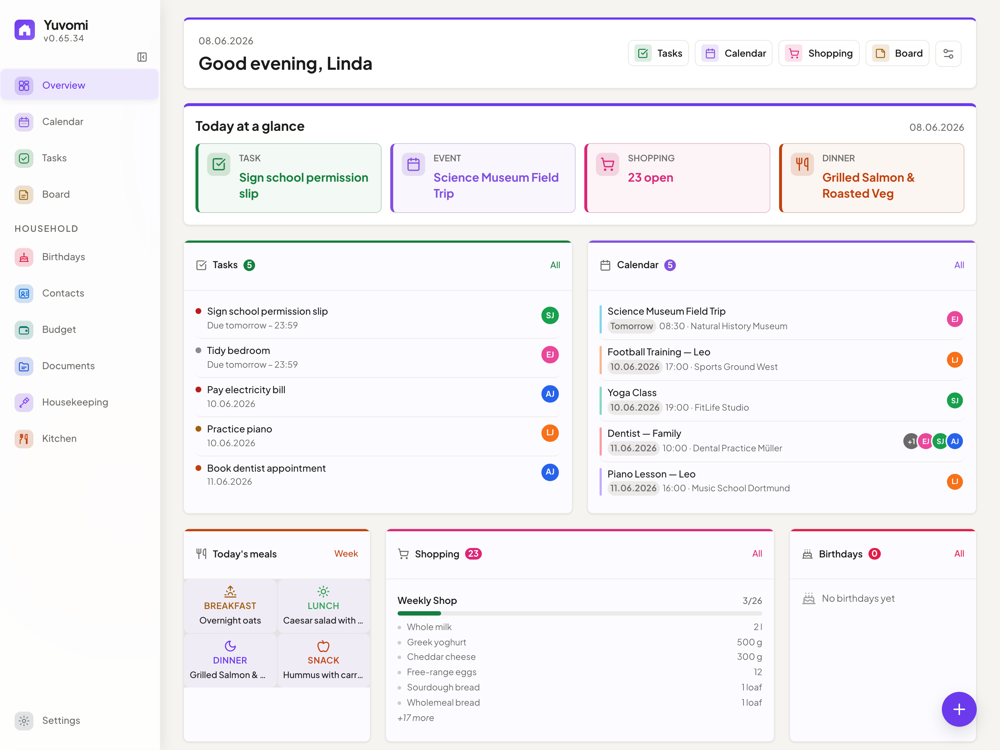
        </picture>
      </td>
      <td width="28%" align="center" valign="middle">
        <picture>
          <source media="(prefers-color-scheme: dark)" srcset="docs/screenshots/dashboard-dark-mobile.png">
          <source media="(prefers-color-scheme: light)" srcset="docs/screenshots/dashboard-light-mobile.png">
          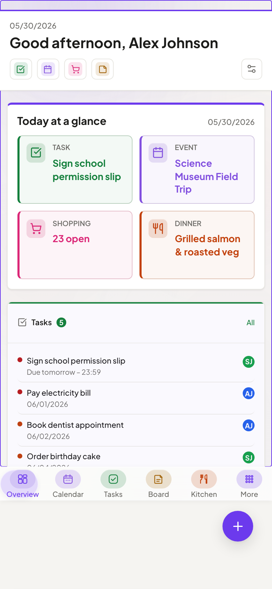
        </picture>
        <br>
        <sub>Mobile PWA</sub>
      </td>
    </tr>
  </table>
  <sub>Switch GitHub to dark mode to preview the dark theme.</sub>
</div>

<br>

Yuvomi keeps your household organized — tasks, groceries, meals, calendar, budget, and more — in one private place, without cloud accounts or subscriptions. Runs as a Docker or Podman container on any home server or NAS, including rootless Podman on SELinux-enabled RHEL/Fedora/CentOS Stream systems. A polished, mobile-first PWA makes it feel native on every device.

Each module is independent. Use what fits, skip what doesn't.

<details>
<summary><sub>Coming from <b>Oikos</b>? This project was renamed — nothing about the app changes.</sub></summary>

<br>

Yuvomi was renamed from **Oikos** to avoid a trademark conflict with an unrelated product. Same code, same data, same maintainer.

- Old links (`github.com/ulsklyc/oikos`) redirect here automatically.
- The Docker image moved to `ghcr.io/ulsklyc/yuvomi`; the old `ghcr.io/ulsklyc/oikos` keeps working — please update at your convenience.
- Existing data and settings are fully preserved on upgrade.

New home: **https://yuvomi.cloud/** · Questions? Open a [discussion](https://github.com/ulsklyc/yuvomi/discussions).

</details>

<div align="center">
  <sub>
    <a href="#app-screenshots">Screenshots</a> &nbsp;·&nbsp;
    <a href="#modules">Modules</a> &nbsp;·&nbsp;
    <a href="#design--technology">Design</a> &nbsp;·&nbsp;
    <a href="#install-anywhere">Install</a> &nbsp;·&nbsp;
    <a href="#tech-stack">Tech stack</a> &nbsp;·&nbsp;
    <a href="#documentation">Docs</a>
  </sub>
</div>

---

## App screenshots

<div align="center">
  <table>
    <tr>
      <td align="center" width="50%">
        <picture>
          <source media="(prefers-color-scheme: dark)" srcset="docs/screenshots/health-cycle-dark-web.png">
          <source media="(prefers-color-scheme: light)" srcset="docs/screenshots/health-cycle-light-web.png">
          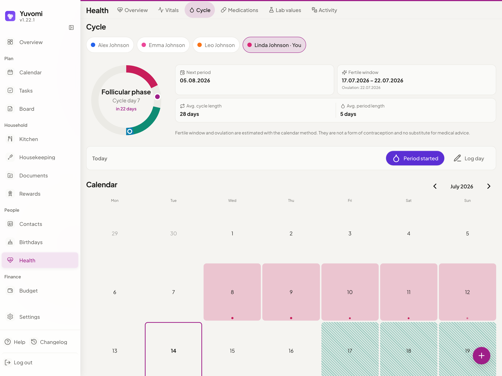
        </picture>
        <br><sub><b>Health</b> — Vitals, meds, labs, activity & cycle tracking, per member</sub>
      </td>
      <td align="center" width="50%">
        <picture>
          <source media="(prefers-color-scheme: dark)" srcset="docs/screenshots/rewards-dark-web.png">
          <source media="(prefers-color-scheme: light)" srcset="docs/screenshots/rewards-light-web.png">
          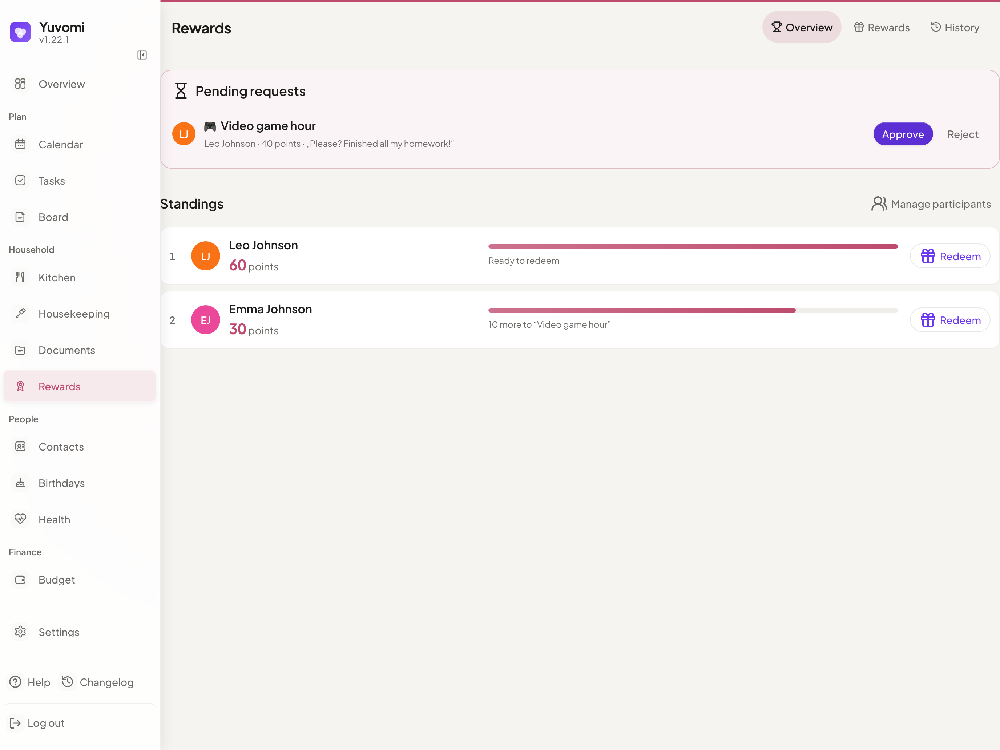
        </picture>
        <br><sub><b>Rewards</b> — Points for chores, parent-approved catalog & ledger</sub>
      </td>
    </tr>
    <tr>
      <td align="center">
        <picture>
          <source media="(prefers-color-scheme: dark)" srcset="docs/screenshots/split-expenses-dark-web.png">
          <source media="(prefers-color-scheme: light)" srcset="docs/screenshots/split-expenses-light-web.png">
          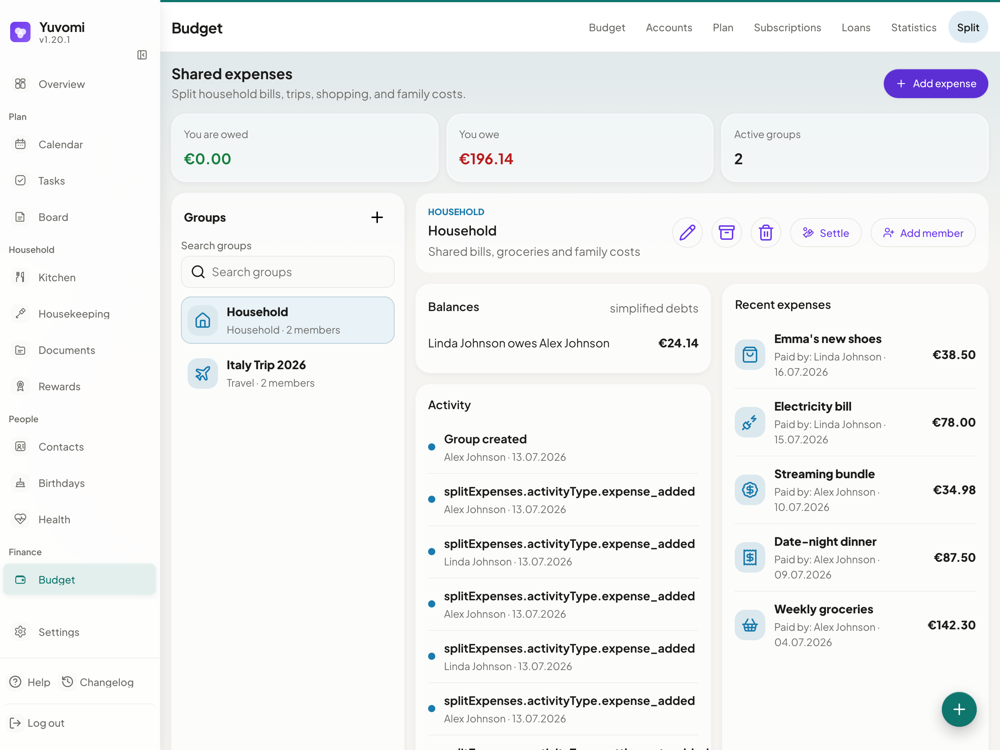
        </picture>
        <br><sub><b>Split expenses</b> — Shared costs with automatic debt simplification</sub>
      </td>
      <td align="center">
        <picture>
          <source media="(prefers-color-scheme: dark)" srcset="docs/screenshots/budget-dark-web.png">
          <source media="(prefers-color-scheme: light)" srcset="docs/screenshots/budget-light-web.png">
          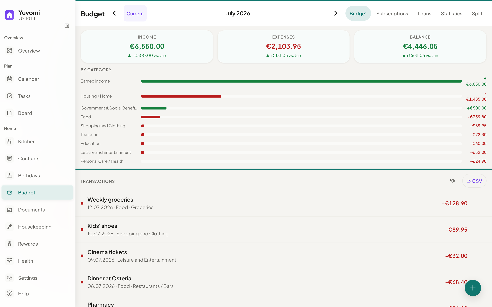
        </picture>
        <br><sub><b>Budget</b> — Income, expenses, subscriptions, CSV export</sub>
      </td>
    </tr>
    <tr>
      <td align="center">
        <picture>
          <source media="(prefers-color-scheme: dark)" srcset="docs/screenshots/tasks-dark-web.png">
          <source media="(prefers-color-scheme: light)" srcset="docs/screenshots/tasks-light-web.png">
          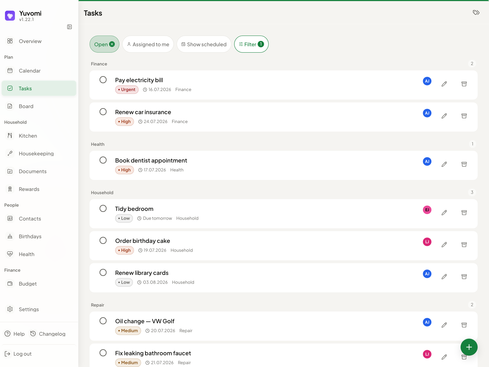
        </picture>
        <br><sub><b>Tasks</b> — Kanban board, recurring schedules, multi-assignment</sub>
      </td>
      <td align="center">
        <picture>
          <source media="(prefers-color-scheme: dark)" srcset="docs/screenshots/calendar-dark-web.png">
          <source media="(prefers-color-scheme: light)" srcset="docs/screenshots/calendar-light-web.png">
          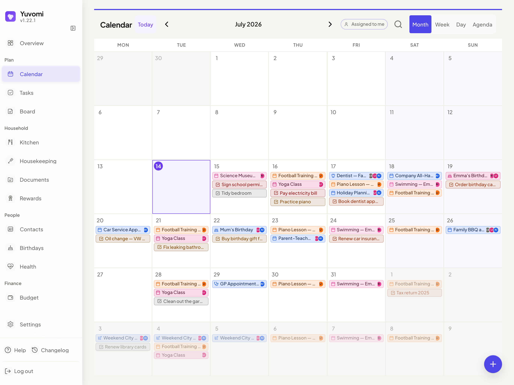
        </picture>
        <br><sub><b>Calendar</b> — Google OAuth, iCloud, CalDAV, ICS subscriptions &amp; import</sub>
      </td>
    </tr>
    <tr>
      <td align="center">
        <picture>
          <source media="(prefers-color-scheme: dark)" srcset="docs/screenshots/meals-dark-web.png">
          <source media="(prefers-color-scheme: light)" srcset="docs/screenshots/meals-light-web.png">
          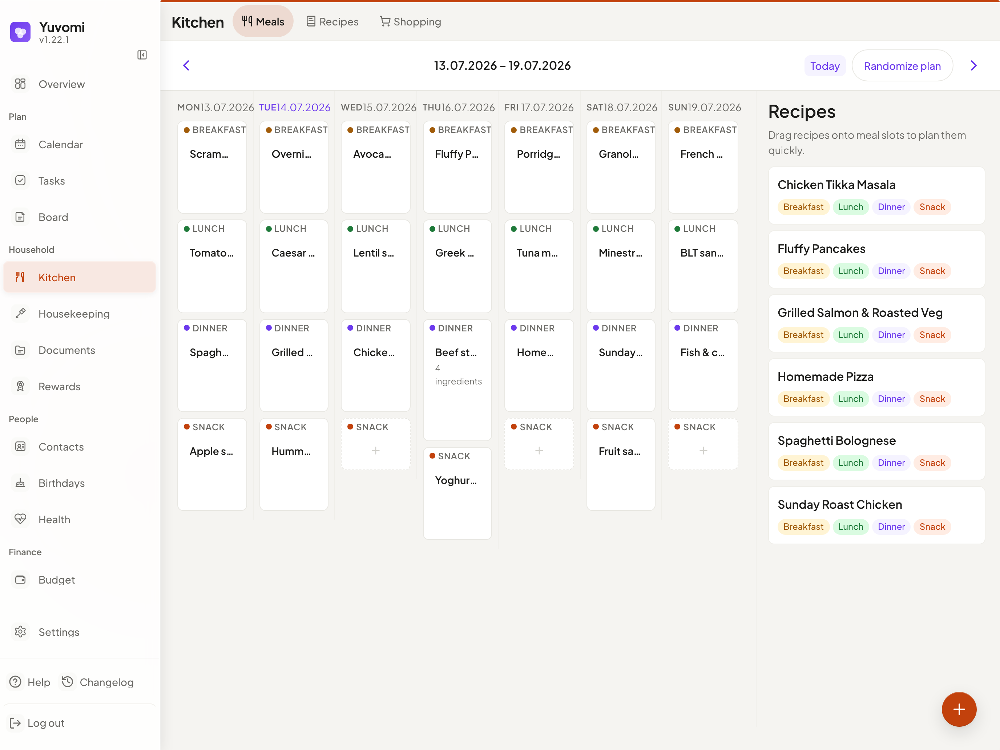
        </picture>
        <br><sub><b>Meals</b> — Weekly planner, recipes, one-click shopping export</sub>
      </td>
      <td align="center">
        <picture>
          <source media="(prefers-color-scheme: dark)" srcset="docs/screenshots/shopping-dark-web.png">
          <source media="(prefers-color-scheme: light)" srcset="docs/screenshots/shopping-light-web.png">
          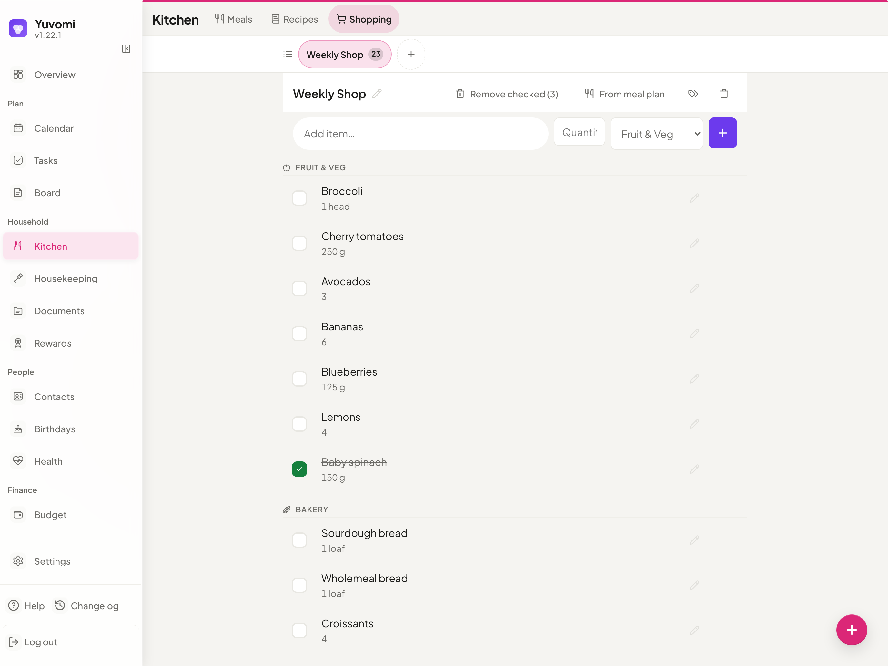
        </picture>
        <br><sub><b>Shopping</b> — Shared lists, aisle groups, swipe gestures</sub>
      </td>
    </tr>
  </table>

  <sub>On mobile, too — every module adapts to phone-sized screens:</sub>
  <br>
  <picture>
    <source media="(prefers-color-scheme: dark)" srcset="docs/screenshots/health-cycle-dark-mobile.png">
    <source media="(prefers-color-scheme: light)" srcset="docs/screenshots/health-cycle-light-mobile.png">
    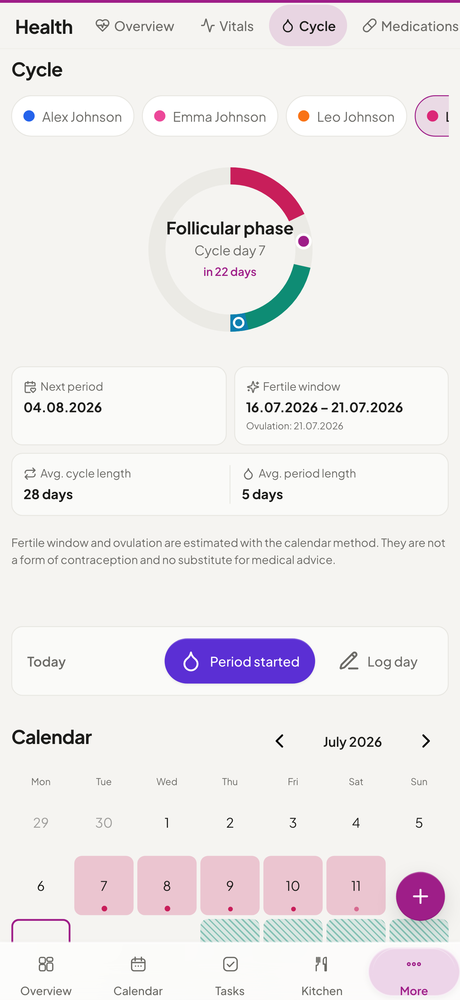
  </picture>
  &nbsp;
  <picture>
    <source media="(prefers-color-scheme: dark)" srcset="docs/screenshots/rewards-dark-mobile.png">
    <source media="(prefers-color-scheme: light)" srcset="docs/screenshots/rewards-light-mobile.png">
    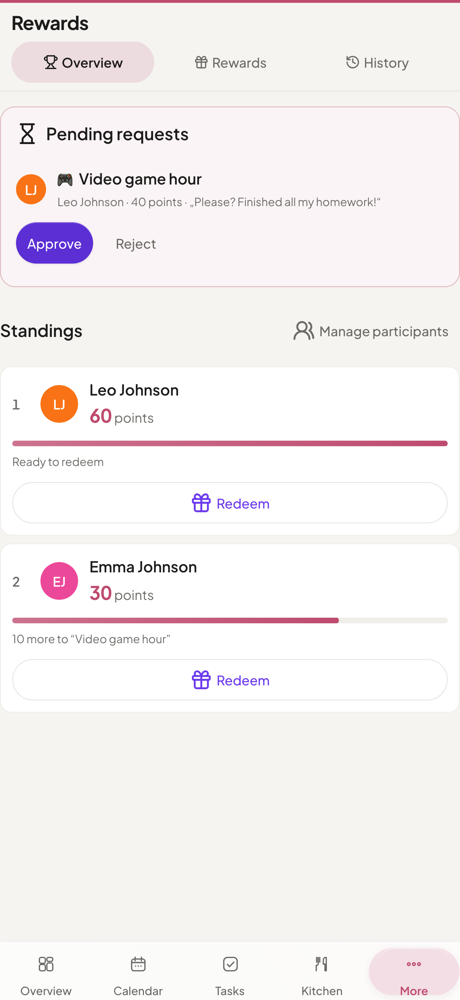
  </picture>
  &nbsp;
  <picture>
    <source media="(prefers-color-scheme: dark)" srcset="docs/screenshots/tasks-dark-mobile.png">
    <source media="(prefers-color-scheme: light)" srcset="docs/screenshots/tasks-light-mobile.png">
    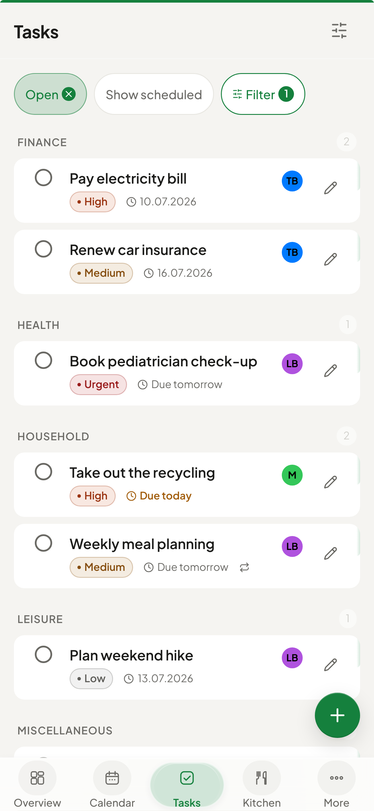
  </picture>
  &nbsp;
  <picture>
    <source media="(prefers-color-scheme: dark)" srcset="docs/screenshots/calendar-dark-mobile.png">
    <source media="(prefers-color-scheme: light)" srcset="docs/screenshots/calendar-light-mobile.png">
    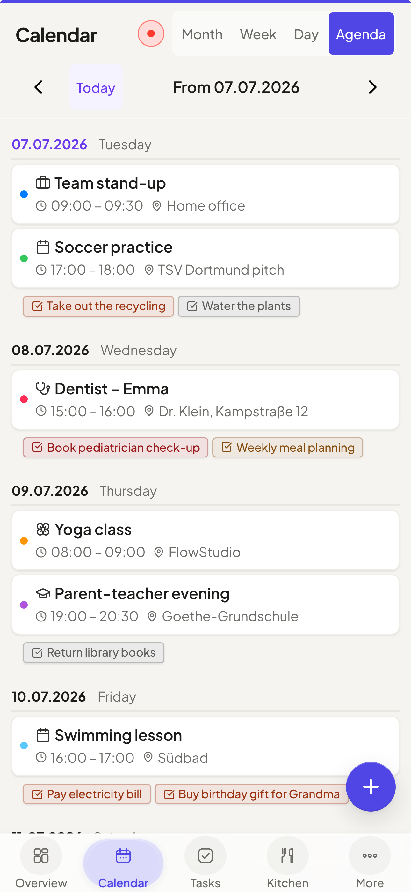
  </picture>

  <br><br>
  <a href="https://yuvomi.cloud/">See all screenshots →</a>
</div>

---

## Modules

| | Module | What it does |
|:---:|---|---|
|  | **Tasks** | Deadlines, priorities, subtasks, recurring schedules, multi-member assignment, per-task visibility (only me / assignees / everyone), customizable categories, linked documents from the Documents module, an "assigned to me" filter, and a Kanban board. Optional CalDAV import of Apple Reminders. |
|  | **Shopping** | Collaborative lists grouped by aisle, with swipe gestures, per-item notes, and one-tap import from the meal plan. |
|  | **Meals** | Weekly planner with multiple items per slot, weekly repeats, a drag-and-drop recipe sidebar, a one-click week randomizer, and direct export to the shopping list. |
|  | **Recipes** | Create, duplicate, and scale recipes; pre-fill meal slots or save any planned meal as a recipe. |
|  | **Calendar** | Google (OAuth) and CalDAV sync (iCloud, Nextcloud, Radicale), ICS subscriptions, one-time import from an `.ics` file or shared feed into editable local events, recurring events with per-occurrence scope (edit or delete this event, this and following, or the whole series), attachments, holiday overlays, keyword search across title, location and notes (accent-insensitive, finds events whose date you don't know), an "assigned to me" filter, per-event visibility, a default assignee per synced calendar, assigned members shown as avatars on each event, a configurable week start (Monday, Sunday or Saturday), and a read-only `webcal://` export feed that can optionally show assigned members in the event title. |
|  | **Documents** | Upload, tag, preview, and organize family files with per-document visibility. Multi-file upload, folders, sorting, counted category facets, and bulk move/archive/delete. Optional local folder or WebDAV storage plus Paperless-ngx and Papra (DMS) linking. |
|  | **Budget** | Income, expenses, recurring entries, trend charts, a statistics tab, CSV export, accounts with starting balances and running totals plus net worth, loans, split expenses, subscription tracking with renewals and currencies, a planning tab with per-category monthly budgets and a savings goal (planned vs. actual), and an optional personal budget mode where each entry can be private or shared with a My budget / Household view. |
|  | **Housekeeping** | Manage household staff — schedules, check-in/out, daily or hourly billing, chores, and supply requests. |
|  | **Rewards** | Point values on tasks credit assigned members; a reward catalog with parent-approved redemptions, per-member opt-in, and an auditable ledger. |
|  | **Health** | Per-member vitals, medications with refill alerts, lab results, activity logs, and menstrual cycle tracking (period predictions, fertile window, cycle ring, pregnancy mode) — with trend charts, CSV export, and per-entry visibility. |
|  | **Notes & Contacts** | Colored Markdown sticky notes that open in a rendered reader view (toggle to edit) plus a contact directory with CardDAV sync and multi-contact vCard import/export. |
|  | **Birthdays** | Birthday tracker with automatic calendar events, age display, custom reminders, and selective import from synced contacts. |
|  | **Family** | Member profiles with roles, photos, and contact details — synced to Contacts and Birthdays. |
|  | **Reminders** | Task and calendar reminders via in-app badges, opt-in Web Push (HTTPS), and household Gotify/ntfy channels. |
|  | **API Tokens** | Bearer / X-API-Key tokens with an OpenAPI 3.0 spec and a built-in MCP endpoint (`/mcp`) that lets AI agents like Claude Desktop drive the whole API in natural language. Optional per-module read/write scopes keep a token — e.g. one handed to an AI client — off sensitive areas. |
|  | **Backup** | Manual and scheduled database backup/restore with pre-restore rollback. Optional WebDAV upload (Nextcloud, ownCloud, etc.). |

<sub>Full data model and per-module details in the <a href="docs/SPEC.md">Spec</a>.</sub>

> **Health is not a medical device** — no diagnostic claims. Health data is sensitive; enable database encryption (`DB_ENCRYPTION_KEY`, SQLCipher).

> **WebDAV document storage needs its own backup.** Database backups hold document metadata and links, not the binaries on WebDAV — back up that target separately. Admin-UI WebDAV targets must resolve to public addresses; for a trusted LAN or loopback target, set `DOCUMENT_STORAGE_WEBDAV_URL` via the deployment environment, or `DOCUMENT_STORAGE_WEBDAV_ALLOW_PRIVATE_NETWORK=true` to allow private targets from the UI too.

> **Internal (LAN / private IP) targets are blocked by default.** SSRF protection rejects private, loopback, link-local, and internal-DNS URLs for ICS calendar subscriptions and WebDAV document storage. To use an internally-resolving URL, set the matching opt-in in your deployment environment: `ICS_SUBSCRIPTION_ALLOW_PRIVATE_NETWORK=true` for calendar feeds, `DOCUMENT_STORAGE_WEBDAV_ALLOW_PRIVATE_NETWORK=true` for document storage. See the [Installation Guide](docs/installation.md#environment-variables).

---

## Design & technology

- **Disciplined Liquid Glass UI** — readable work surfaces, subtle translucent navigation, spring animations, and module-tinted overlays — built in pure CSS, no framework
- **PWA** — installable on any device, works offline (read-only access to your last-seen calendar, tasks, shopping, contacts, and dashboard), and stays responsive from phone to desktop with a persistent mobile bar, configurable favorites, and tuned touch targets
- **Privacy first** — fully self-hosted, optional SQLCipher AES-256 database encryption (enabled in the recommended Docker setup), zero telemetry
- **SSO / OpenID Connect** — optional single sign-on via any OIDC provider (Authentik, Keycloak, Google, Microsoft Entra) configured with four env vars; Authorization Code + PKCE flow
- **Self-service password reset** — optional SMTP email lets users reset a forgotten password themselves via a time-limited emailed link; anti-enumeration by design
- **Zero build step** — pure ES modules, no bundler, no transpiler, no framework
- **Multilingual** — 23 languages with automatic locale detection (de, en, es, fr, it, sv, el, ru, tr, zh, ja, ar, hi, pt, uk, pl, nl, cs, vi, hu, ko, id, fa)

---

## Install anywhere

### Web installer (recommended)

A localized setup wizard — 23 languages — that runs in your browser. Auto-detects Docker or Podman, configures HTTPS, SSO, and scheduled backups, then starts the container and creates your admin account.

```bash
git clone https://github.com/ulsklyc/yuvomi.git && cd yuvomi
node tools/installer/install-server.js
```

Open **http://localhost:8090**. Requires Node.js 18+ on the host to run the installer — the app container ships its own Node 22.

### Docker / Podman

**Pre-built image:**

```bash
curl -O https://raw.githubusercontent.com/ulsklyc/yuvomi/main/docker-compose.yml
curl -O https://raw.githubusercontent.com/ulsklyc/yuvomi/main/.env.example
cp .env.example .env          # set SESSION_SECRET and DB_ENCRYPTION_KEY
docker compose up -d
```

**Build from source:**

```bash
git clone https://github.com/ulsklyc/yuvomi.git && cd yuvomi
cp .env.example .env
docker compose up -d --build
```

Open `http://localhost:3000`. The first visit walks you through creating your admin account.

> **Podman (RHEL / Fedora / CentOS Stream):** Both installers auto-detect Podman and use `podman-compose.yml` with SELinux `:Z` labels. For a manual start: `podman compose -f podman-compose.yml up -d`. Rootless systemd autostart: `tools/quadlet/oikos.container`.

### NAS & home servers

<table>
  <tr>
    <td><b>TrueNAS SCALE</b></td>
    <td>Apps → Discover Apps → search <b>Yuvomi</b> → Install</td>
    <td>No terminal required. Community Apps Catalog. Version updates via Renovate.</td>
  </tr>
  <tr>
    <td><b>Umbrel</b></td>
    <td>App Store → search <b>Yuvomi</b> → Install</td>
    <td>One-click install. Everything stays on your Umbrel.</td>
  </tr>
  <tr>
    <td><b>Unraid</b></td>
    <td>Apps → search <b>Yuvomi</b> → Apply</td>
    <td>Community Applications template. Set <code>SESSION_SECRET</code> during install.</td>
  </tr>
</table>

> **Catalog listings are still registered under the legacy name `oikos`** (TrueNAS `oikos_community`, Unraid `oikos-…`). The app shows and installs as **Yuvomi** — the technical slug is kept so existing installations (database paths and container names) upgrade seamlessly rather than breaking. Search for **Yuvomi**; if a store still surfaces the entry as *oikos*, it's the same app.

> **New to Docker or Podman?** The **[Installation Guide](docs/installation.md)** covers engine setup, HTTPS/reverse proxy, backups, and troubleshooting step by step.

---

## Tech stack

<p>
  
  
  
  
  
  
  
</p>

---

## Documentation

[Installation](docs/installation.md) &nbsp;·&nbsp; [Spec & data model](docs/SPEC.md) &nbsp;·&nbsp; [Modules](MODULES.md) &nbsp;·&nbsp; [Contributing](CONTRIBUTING.md) &nbsp;·&nbsp; [Security](SECURITY.md) &nbsp;·&nbsp; [Privacy for self-hosters](docs/PRIVACY-FOR-SELFHOSTERS.md) &nbsp;·&nbsp; [Changelog](CHANGELOG.md) &nbsp;·&nbsp; [Backlog](BACKLOG.md)

If you self-host Yuvomi in a GDPR context (EU/EEA, processing other people's data), read [docs/PRIVACY-FOR-SELFHOSTERS.md](docs/PRIVACY-FOR-SELFHOSTERS.md) before going live: it covers third-country assessments for every external service (weather, CalDAV/CardDAV, OIDC, WebDAV backup and document storage), data-processing-agreement notes, log-retention guidance, and a records-of-processing template.

---

## License

MIT — see [LICENSE](LICENSE).

<div align="center">
  <br>
  <sub>Built with care for families who value privacy and simplicity.</sub>
</div>
