<div align="center">
  

  <h1>Yuvomi</h1>

  <p><strong>One private home for everything your family runs on.</strong></p>

  <p>
    Tasks, calendar, budget, groceries, meals, health and more, self-hosted on your own
    server. No cloud accounts. No subscriptions. Zero trackers. Your family's data stays yours.
  </p>

  <p>
    <a href="https://github.com/ulsklyc/yuvomi/releases"></a>
    <a href="https://github.com/ulsklyc/yuvomi/stargazers"></a>
    
    <a href="https://github.com/ulsklyc/yuvomi/pkgs/container/yuvomi"></a>
    <a href="LICENSE"></a>
  </p>

  <p>
    <a href="#install-anywhere"><strong>→ Install in minutes</strong></a> &nbsp;·&nbsp;
    <a href="https://yuvomi.cloud/"><strong>Live demo &amp; screenshots</strong></a> &nbsp;·&nbsp;
    <a href="docs/SPEC.md"><strong>Docs</strong></a> &nbsp;·&nbsp;
    <a href="CHANGELOG.md"><strong>Changelog</strong></a>
  </p>

  <sub><a href="README.de.md">Auf Deutsch lesen</a></sub>
</div>

<br>

<div align="center">
  <table>
    <tr>
      <td width="72%" align="center">
        <picture>
          <source media="(prefers-color-scheme: dark)" srcset="docs/screenshots/dashboard-dark-web.png">
          <source media="(prefers-color-scheme: light)" srcset="docs/screenshots/dashboard-light-web.png">
          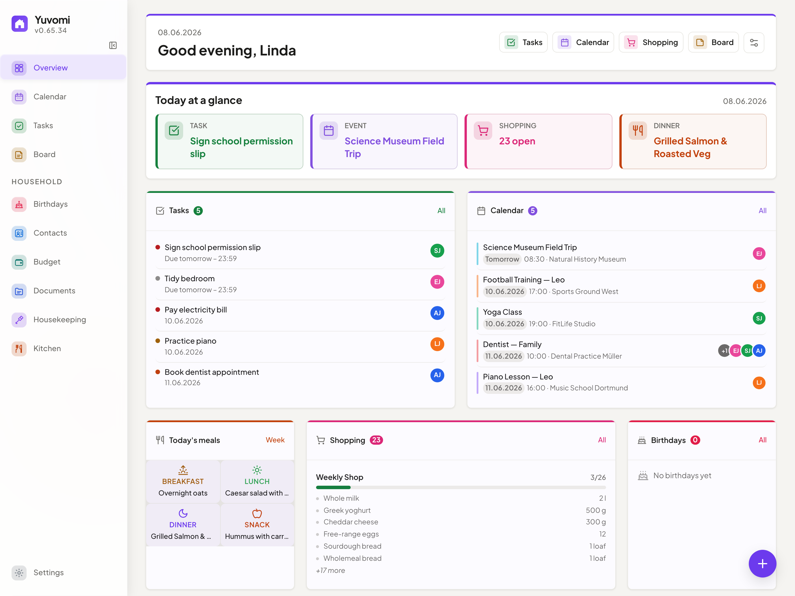
        </picture>
      </td>
      <td width="28%" align="center" valign="middle">
        <picture>
          <source media="(prefers-color-scheme: dark)" srcset="docs/screenshots/dashboard-dark-mobile.png">
          <source media="(prefers-color-scheme: light)" srcset="docs/screenshots/dashboard-light-mobile.png">
          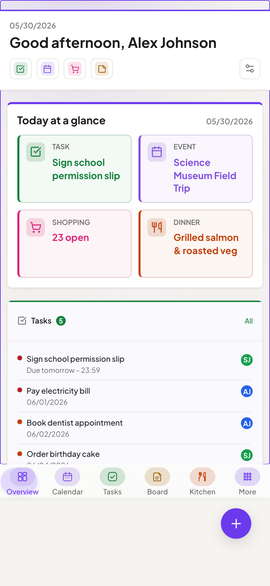
        </picture>
        <br>
        <sub>Mobile PWA</sub>
      </td>
    </tr>
  </table>
  <sub>Switch GitHub to dark mode to preview the dark theme.</sub>
</div>

<br>

<div align="center">
  <table>
    <tr>
      <td align="center"><b>17</b><br><sub>modules</sub></td>
      <td align="center"><sub>·</sub></td>
      <td align="center"><b>24</b><br><sub>languages</sub></td>
      <td align="center"><sub>·</sub></td>
      <td align="center"><b>0</b><br><sub>trackers</sub></td>
      <td align="center"><sub>·</sub></td>
      <td align="center"><b>AES-256</b><br><sub>optional DB encryption</sub></td>
      <td align="center"><sub>·</sub></td>
      <td align="center"><b>MIT</b><br><sub>license</sub></td>
    </tr>
  </table>
</div>

<br>

Yuvomi replaces a pile of cloud subscriptions with one private place that belongs to your household, not a vendor. It runs as a Docker or Podman container on any home server or NAS, including rootless Podman on SELinux-enabled RHEL, Fedora and CentOS Stream. A polished, mobile-first PWA makes it feel native on every device. Every module is independent, so you use what fits and skip what doesn't.

<div align="center">
  <sub>
    <a href="#why-yuvomi">Why Yuvomi</a> &nbsp;·&nbsp;
    <a href="#screenshots">Screenshots</a> &nbsp;·&nbsp;
    <a href="#modules">Modules</a> &nbsp;·&nbsp;
    <a href="#install-anywhere">Install</a> &nbsp;·&nbsp;
    <a href="#faq">FAQ</a> &nbsp;·&nbsp;
    <a href="#under-the-hood">Under the hood</a> &nbsp;·&nbsp;
    <a href="#documentation">Docs</a>
  </sub>
</div>

---

## Why Yuvomi

Most families glue their life together from a dozen paid apps, each with its own account, its own subscription, and its own copy of your data on someone else's server. Yuvomi brings that into one place you own.

### One private app instead of a dozen subscriptions

| Instead of juggling… | Yuvomi gives you |
|---|---|
| a to-do &amp; task app | **Tasks** - Kanban, deadlines, recurring, multi-assignment |
| a shared calendar subscription | **Calendar** - sync, subscriptions, per-event visibility |
| a cost-splitting app | **Split expenses** - shared costs with debt simplification |
| a budgeting app | **Budget** - income, expenses, accounts, savings goals |
| a meal planner &amp; recipe app | **Meals &amp; Recipes** - weekly planner with shopping export |
| a grocery-list app | **Shopping** - shared, aisle-organized lists |
| a pantry &amp; expiry tracker | **Pantry** - stock, storage location, best-before dates |
| a document manager | **Documents** - tagged, searchable family files |
| a notes app &amp; contacts sync | **Notes &amp; Contacts** - Markdown notes, CardDAV sync |

<br>

<table>
  <tr>
    <td width="50%" valign="top">
      <b>Private by design</b><br>
      <sub>Self-hosted on your hardware. Optional SQLCipher AES-256 database encryption, zero telemetry, no trackers, and no accounts beyond your own household. Internal (LAN) targets are blocked by default; SSO and self-service password reset are opt-in.</sub>
    </td>
    <td width="50%" valign="top">
      <b>Works on every device</b><br>
      <sub>An installable PWA that feels native from phone to desktop. Works offline with read-only access to your last-seen calendar, tasks, shopping, contacts and dashboard. Tuned touch targets, a persistent mobile bar, and configurable favorites.</sub>
    </td>
  </tr>
  <tr>
    <td width="50%" valign="top">
      <b>For the whole family</b><br>
      <sub>Every member is a user, not just the admin. Roles, photos, avatars on events and tasks, and per-item visibility (only me / assignees / everyone) so private stays private while the shared calendar stays shared.</sub>
    </td>
    <td width="50%" valign="top">
      <b>Yours to keep</b><br>
      <sub>MIT-licensed and free. Your data lives on your server, exports to CSV, ICS and vCard, and backs up on your schedule. No lock-in, no price hikes, no shutdown notice.</sub>
    </td>
  </tr>
</table>

---

## Screenshots

<div align="center">
  <table>
    <tr>
      <td align="center" width="50%">
        <picture>
          <source media="(prefers-color-scheme: dark)" srcset="docs/screenshots/health-cycle-dark-web.png">
          <source media="(prefers-color-scheme: light)" srcset="docs/screenshots/health-cycle-light-web.png">
          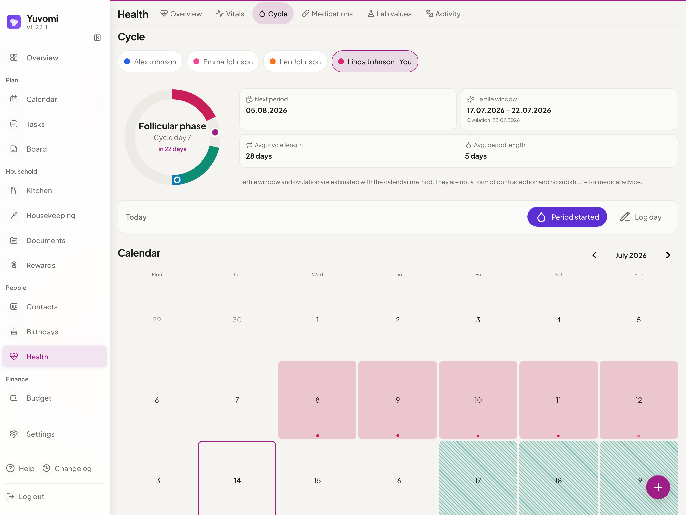
        </picture>
        <br><sub><b>Health</b> - Vitals, meds, labs, activity &amp; cycle tracking, per member</sub>
      </td>
      <td align="center" width="50%">
        <picture>
          <source media="(prefers-color-scheme: dark)" srcset="docs/screenshots/rewards-dark-web.png">
          <source media="(prefers-color-scheme: light)" srcset="docs/screenshots/rewards-light-web.png">
          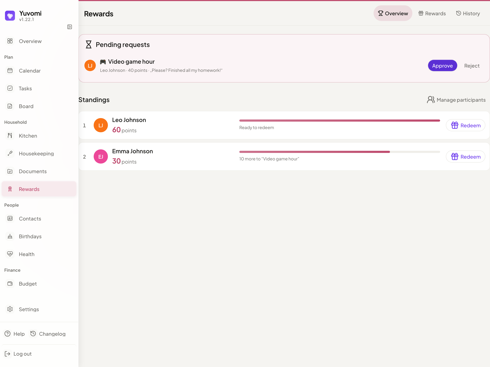
        </picture>
        <br><sub><b>Rewards</b> - Points for chores, parent-approved catalog &amp; ledger</sub>
      </td>
    </tr>
    <tr>
      <td align="center">
        <picture>
          <source media="(prefers-color-scheme: dark)" srcset="docs/screenshots/split-expenses-dark-web.png">
          <source media="(prefers-color-scheme: light)" srcset="docs/screenshots/split-expenses-light-web.png">
          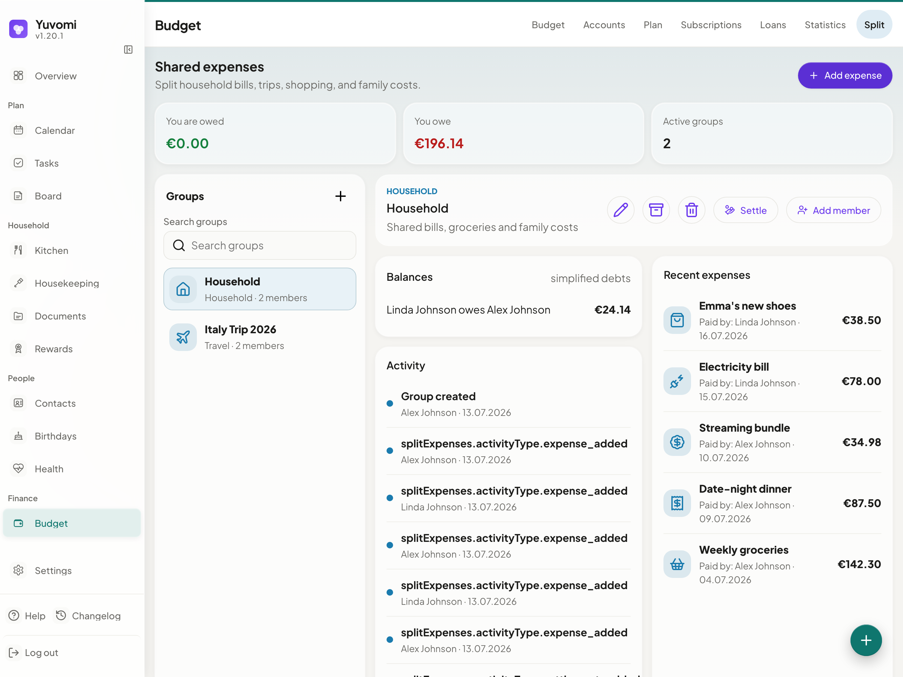
        </picture>
        <br><sub><b>Split expenses</b> - Shared costs with automatic debt simplification</sub>
      </td>
      <td align="center">
        <picture>
          <source media="(prefers-color-scheme: dark)" srcset="docs/screenshots/budget-dark-web.png">
          <source media="(prefers-color-scheme: light)" srcset="docs/screenshots/budget-light-web.png">
          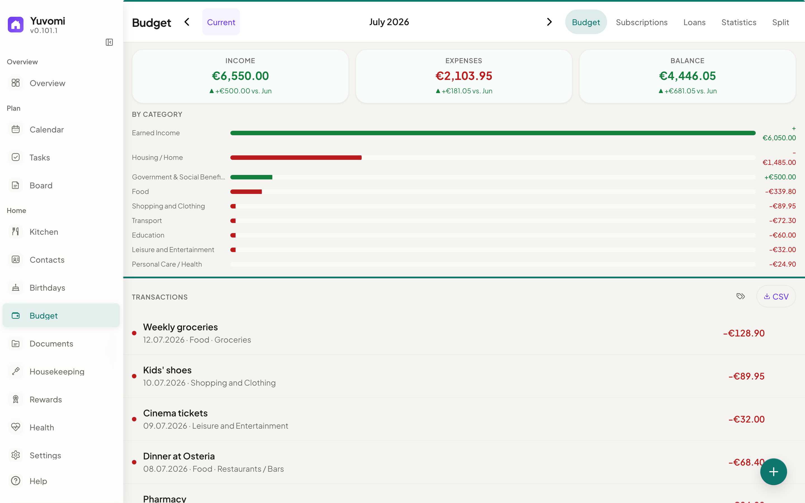
        </picture>
        <br><sub><b>Budget</b> - Income, expenses, subscriptions, CSV export</sub>
      </td>
    </tr>
    <tr>
      <td align="center">
        <picture>
          <source media="(prefers-color-scheme: dark)" srcset="docs/screenshots/tasks-dark-web.png">
          <source media="(prefers-color-scheme: light)" srcset="docs/screenshots/tasks-light-web.png">
          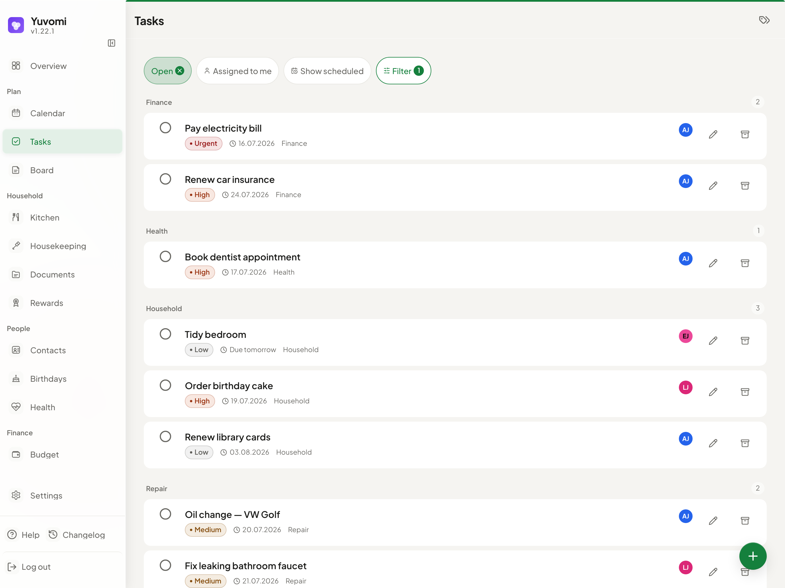
        </picture>
        <br><sub><b>Tasks</b> - Kanban board, recurring schedules, multi-assignment</sub>
      </td>
      <td align="center">
        <picture>
          <source media="(prefers-color-scheme: dark)" srcset="docs/screenshots/calendar-dark-web.png">
          <source media="(prefers-color-scheme: light)" srcset="docs/screenshots/calendar-light-web.png">
          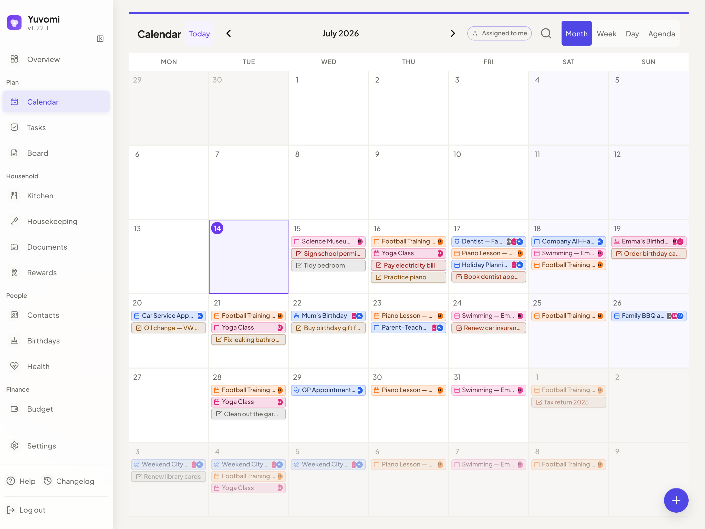
        </picture>
        <br><sub><b>Calendar</b> - Google OAuth, iCloud, CalDAV, ICS subscriptions &amp; import</sub>
      </td>
    </tr>
    <tr>
      <td align="center">
        <picture>
          <source media="(prefers-color-scheme: dark)" srcset="docs/screenshots/meals-dark-web.png">
          <source media="(prefers-color-scheme: light)" srcset="docs/screenshots/meals-light-web.png">
          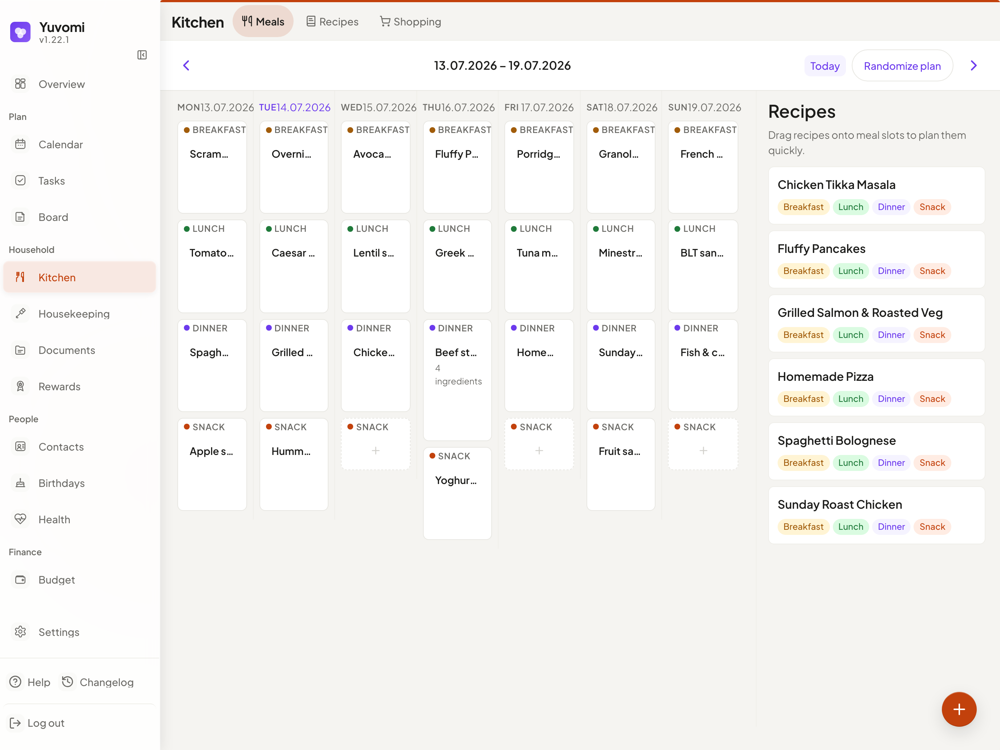
        </picture>
        <br><sub><b>Meals</b> - Weekly planner, recipes, one-click shopping export</sub>
      </td>
      <td align="center">
        <picture>
          <source media="(prefers-color-scheme: dark)" srcset="docs/screenshots/shopping-dark-web.png">
          <source media="(prefers-color-scheme: light)" srcset="docs/screenshots/shopping-light-web.png">
          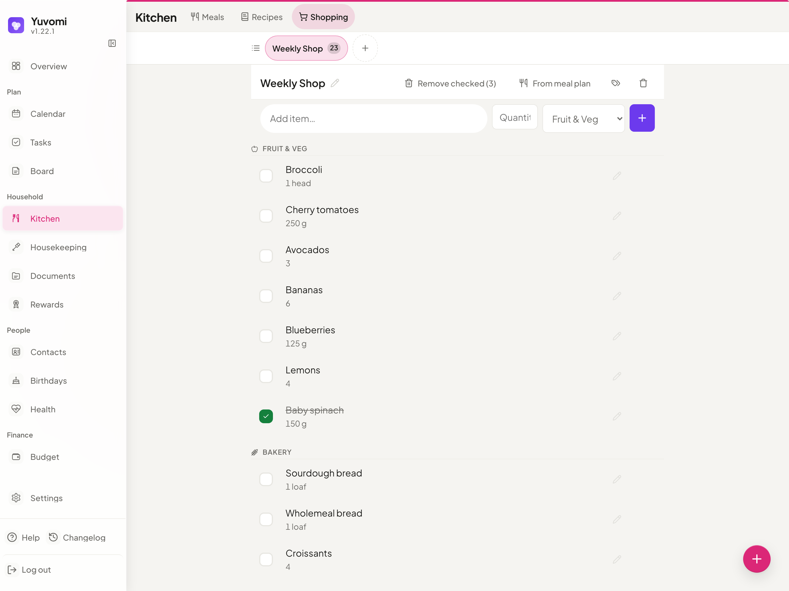
        </picture>
        <br><sub><b>Shopping</b> - Shared lists, aisle groups, swipe gestures</sub>
      </td>
    </tr>
  </table>

  <sub>On mobile, too - every module adapts to phone-sized screens:</sub>
  <br>
  <picture>
    <source media="(prefers-color-scheme: dark)" srcset="docs/screenshots/health-cycle-dark-mobile.png">
    <source media="(prefers-color-scheme: light)" srcset="docs/screenshots/health-cycle-light-mobile.png">
    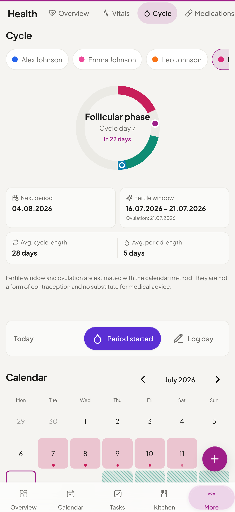
  </picture>
  &nbsp;
  <picture>
    <source media="(prefers-color-scheme: dark)" srcset="docs/screenshots/rewards-dark-mobile.png">
    <source media="(prefers-color-scheme: light)" srcset="docs/screenshots/rewards-light-mobile.png">
    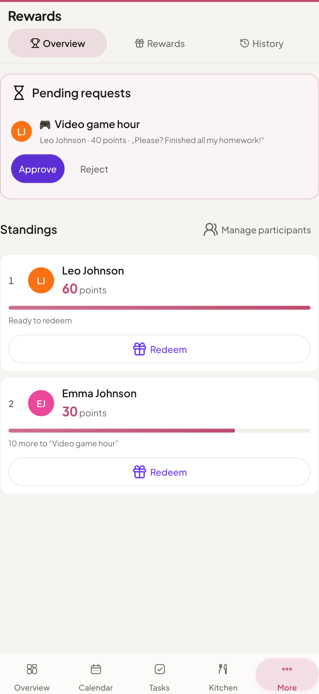
  </picture>
  &nbsp;
  <picture>
    <source media="(prefers-color-scheme: dark)" srcset="docs/screenshots/tasks-dark-mobile.png">
    <source media="(prefers-color-scheme: light)" srcset="docs/screenshots/tasks-light-mobile.png">
    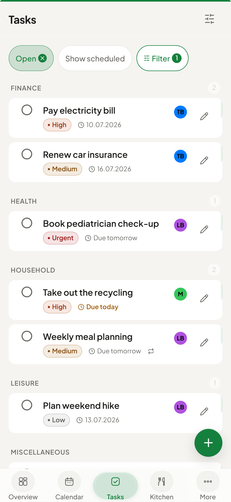
  </picture>
  &nbsp;
  <picture>
    <source media="(prefers-color-scheme: dark)" srcset="docs/screenshots/calendar-dark-mobile.png">
    <source media="(prefers-color-scheme: light)" srcset="docs/screenshots/calendar-light-mobile.png">
    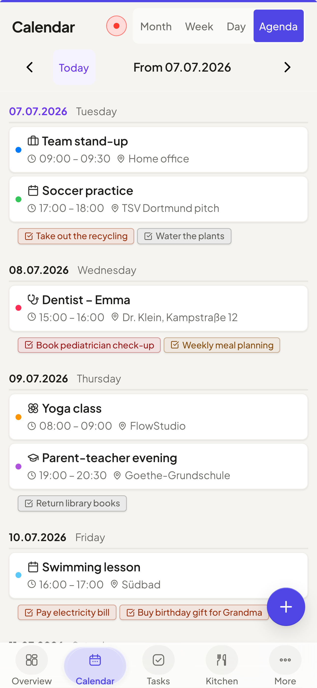
  </picture>

  <br><br>
  <a href="https://yuvomi.cloud/">See every screen on yuvomi.cloud →</a>
</div>

---

## Modules

Seventeen independent modules share one calm, consistent interface. Turn on what your household needs; the rest stays out of the way.

| | Module | In one line |
|:---:|---|---|
|  | **Tasks** | Kanban board with deadlines, priorities, subtasks, tags, recurring schedules and multi-member assignment. |
|  | **Shopping** | Collaborative lists grouped by aisle, with swipe gestures and one-tap import from the meal plan. |
|  | **Meals** | Weekly drag-and-drop planner with a recipe sidebar and direct export to the shopping list. |
|  | **Recipes** | Create, duplicate and scale recipes, then pre-fill meal slots, send the ingredients straight to a shopping list, or save any planned meal. Optionally mirrors a self-hosted Mealie instance read-only. |
|  | **Pantry** | What is actually in the house: amount, storage location and best-before date, with expiry and low-stock filters and a two-way handover with the shopping list. |
|  | **Calendar** | Two-way sync with Google and CalDAV, ICS subscriptions, recurring events, holiday overlays and shared visibility. |
|  | **Documents** | Upload, tag, preview and organize family files, with optional WebDAV or Google Drive storage. |
|  | **Budget** | Income, expenses, accounts, loans, subscriptions and per-category planning, with a personal mode. |
|  | **Housekeeping** | Manage household staff: schedules, check-in/out, daily or hourly billing, chores and supply requests. |
|  | **Rewards** | Points on tasks credit assigned members, with a configurable default value for new tasks, a parent-approved catalog and an auditable ledger. |
|  | **Health** | Per-member vitals, medications, labs, activity and menstrual cycle tracking, with trend charts. |
|  | **Notes &amp; Contacts** | Colored Markdown sticky notes plus a contact directory with CardDAV sync and vCard import/export. |
|  | **Birthdays** | Birthday tracker with automatic calendar events, age display and reminders. |
|  | **Family** | Member profiles with roles, photos and contact details, synced to Contacts and Birthdays. New members join through an invite link and pick their own password. |
|  | **Reminders** | Task and calendar reminders via in-app badges, opt-in Web Push and household Gotify/ntfy channels. |
|  | **API Tokens** | Bearer / X-API-Key tokens with an OpenAPI 3.0 spec and a built-in MCP endpoint for AI agents. |
|  | **Backup** | Manual and scheduled database backup/restore with pre-restore rollback and optional WebDAV upload. |

<details>
<summary><b>See everything each module can do →</b></summary>

<br>

- **Tasks** - Deadlines, priorities, subtasks, recurring schedules, multi-member assignment, per-task visibility (only me / assignees / everyone), customizable categories, free-form tags, linked documents from the Documents module, an "assigned to me" filter, keyword search across title, description and tags, and a Kanban board. A recurring task can count its interval from the day you tick it off instead of from its due date, for everything whose rhythm starts with the action rather than with the calendar. Tapping a task opens a read view instead of the edit form, so the keyboard stays down when you only wanted to look something up; editing is a named second step, and the status can be moved on straight from the read view. A task sits in exactly one category but carries any number of tags: click a tag on a card to filter by it, combine several to narrow the list, rename or merge a tag across every task at once, or add and remove one on a whole selection. Optional two-way CalDAV sync with reminder lists (Apple Reminders, Radicale, Nextcloud): completing, editing or deleting a mirrored task reaches the server too, and tags travel both ways as the list's categories.
- **Shopping** - Collaborative lists grouped by aisle, with swipe gestures, per-item notes, one-tap import from the meal plan, and a handover of everything you ticked off straight into the Pantry. Items that came from a CalDAV reminder list show that list's categories as tags.
- **Meals** - Weekly planner with multiple items per slot, weekly repeats, a drag-and-drop recipe sidebar, a one-click week randomizer, and direct export to the shopping list.
- **Recipes** - Create, duplicate, and scale recipes; pre-fill meal slots, send the ingredients straight to a shopping list, or save any planned meal as a recipe. Optionally mirrors a self-hosted Mealie instance: its recipes show up alongside your own with a source badge and a link back, plan and shop with them like any other recipe, and Mealie stays the source of truth for their content - duplicate one to get an editable copy.
- **Pantry** - What is actually in the house, as the fourth side of the kitchen: amount and unit, storage location, best-before date, an optional minimum stock, and a note. A quantity stepper books items in and out in one tap, status badges appear only where they matter (expired, expiring within a week, running low, out), and filters narrow the list to exactly those. Storage locations are renameable and sortable; deleting one keeps the stock. Runs in both directions with the shopping list: low or empty items go onto the list one at a time or all at once (topping up to the minimum stock), and everything ticked off after a shop can be booked into the pantry with its quantity and unit.
- **Calendar** - two-way sync with Google (OAuth) and CalDAV (iCloud, Nextcloud, Radicale), where creating, editing, deleting and moving an event to another calendar all reach the server, ICS subscriptions, one-time import from an `.ics` file or shared feed into editable local events, recurring events with per-occurrence scope (edit or delete this event, this and following, or the whole series), attachments, holiday overlays, keyword search across title, location and notes (accent-insensitive), an "assigned to me" filter, per-event visibility, a default assignee per synced calendar, assigned members shown as avatars, a configurable week start (Monday, Sunday or Saturday), and a read-only `webcal://` export feed that can optionally show the assigned members in each event title. Tapping an appointment opens a read view first, which also states the recurrence in plain language, the reminders and the visibility; editing is a separate step.
- **Documents** - Upload, tag, preview, and organize family files with per-document visibility. Multi-file upload, folders, sorting, counted category facets, and bulk move/archive/delete. Optional local folder, WebDAV or Google Drive storage plus Paperless-ngx and Papra (DMS) linking.
- **Budget** - Income, expenses, recurring entries in any rhythm (weekly, monthly or yearly, every N of them - so every two weeks or every three months, not just the three fixed intervals), optionally booking only once you confirm them, with the amount and date correctable at that moment because not every service debits on the same day or to the cent, trend charts, a statistics tab, CSV export, accounts with starting balances and running totals plus net worth, loans in both directions (money you lent out counts as income when it comes back, a loan you took on counts as an expense when you pay it off, and each one can charge an account; optionally as an annuity with a fixed, variable or fixed-then-variable interest rate, with the payment, term and total interest derived live; each loan can run in its own currency with a fixed conversion rate into the budget currency), split expenses, subscription tracking with renewals, currencies and an optional end date (on a date or after N payments, then auto-completed), a planning tab with per-category monthly budgets and a savings goal (planned vs. actual), receipts on transactions and shared expenses (link a document already filed or upload a new file, several per entry), and an optional personal budget mode where each entry can be private or shared with a My budget / Household view.
- **Housekeeping** - Manage household staff: schedules, check-in/out, daily or hourly billing, chores, and supply requests.
- **Rewards** - Point values on tasks credit assigned members; an optional household default prefills new tasks and can be rolled out to unfinished ones when it changes; a reward catalog with parent-approved redemptions, per-member opt-in, and an auditable ledger.
- **Health** - Per-member vitals (blood pressure, glucose, weight, SpO₂, temperature, sleep duration entered as hours and minutes, and mood on a five-step scale), medications with refill alerts, lab results, activity logs, and menstrual cycle tracking (period predictions, fertile window, cycle ring, pregnancy mode), with trend charts, CSV export, and per-entry visibility. An admin can let one member record for another, so a parent enters a child's fever and medication; the cycle diary stays excluded from that.
- **Notes &amp; Contacts** - Colored Markdown sticky notes that open in a rendered reader view (toggle to edit), with full-text search, a per-author filter and pinned notes grouped up front, plus a contact directory with CardDAV sync and multi-contact vCard import/export. Contacts follow the same grammar: tapping one shows it before it lets you change it, with every stored number, mail and address as its own tap target - the list only ever offered the first of each - and editing as a separate step.
- **Birthdays** - Birthday tracker with automatic calendar events, age display, custom reminders, and selective import from synced contacts.
- **Family** - Member profiles with roles, photos, and contact details, synced to Contacts and Birthdays.
- **Reminders** - Task and calendar reminders via in-app badges, opt-in Web Push (HTTPS), and household Gotify/ntfy channels.
- **API Tokens** - Bearer / X-API-Key tokens with an OpenAPI 3.0 spec and a built-in MCP endpoint (`/mcp`) that lets AI agents like Claude Desktop drive the whole API in natural language. Optional per-module read/write scopes keep a token, for example one handed to an AI client, off sensitive areas.
- **Backup** - Manual and scheduled database backup/restore with pre-restore rollback. Optional WebDAV upload (Nextcloud, ownCloud, etc.).

</details>

<sub>Full data model and per-module details live in the <a href="docs/SPEC.md">Spec</a>; building third-party drop-in modules is covered in the <a href="MODULES.md">module developer guide</a>.</sub>

<details>
<summary><b>Self-hosting notes &amp; safety</b> - worth a read before you go live</summary>

<br>

> **Health is not a medical device.** No diagnostic claims are made. Health data is sensitive, so enable database encryption (`DB_ENCRYPTION_KEY`, SQLCipher).

> **External document storage needs its own backup.** Database backups hold document metadata and links, not binaries stored in a local folder, on WebDAV, or in Google Drive; back up the selected target separately. Yuvomi visibility settings only control access through Yuvomi. Anyone with access to the connected `Yuvomi/Documents` Google Drive folder can view all files stored there. Admin-UI WebDAV targets must resolve to public addresses; for a trusted LAN or loopback target, set `DOCUMENT_STORAGE_WEBDAV_URL` via the deployment environment, or `DOCUMENT_STORAGE_WEBDAV_ALLOW_PRIVATE_NETWORK=true` to allow private targets from the UI too.

> **Internal (LAN / private IP) targets are blocked by default.** SSRF protection rejects private, loopback, link-local, and internal-DNS URLs for ICS calendar subscriptions, WebDAV document storage, and recipe provider mirrors. To use an internally-resolving URL, set the matching opt-in in your deployment environment: `ICS_SUBSCRIPTION_ALLOW_PRIVATE_NETWORK=true` for calendar feeds, `DOCUMENT_STORAGE_WEBDAV_ALLOW_PRIVATE_NETWORK=true` for document storage, `RECIPE_PROVIDER_ALLOW_PRIVATE_NETWORK=true` for recipe provider mirrors. See the [Installation Guide](docs/installation.md#environment-variables).

</details>

---

## Install anywhere

### Web installer (recommended)

A localized setup wizard, in 24 languages, that runs in your browser. It auto-detects Docker or Podman, configures HTTPS, SSO and scheduled backups, then starts the container and creates your admin account.

```bash
git clone https://github.com/ulsklyc/yuvomi.git && cd yuvomi
node tools/installer/install-server.js
```

Open **http://localhost:8090**. Requires Node.js 18+ on the host to run the installer; the app container ships its own Node 22.

### Docker / Podman

**Pre-built image:**

```bash
curl -O https://raw.githubusercontent.com/ulsklyc/yuvomi/main/docker-compose.yml
curl -O https://raw.githubusercontent.com/ulsklyc/yuvomi/main/.env.example
cp .env.example .env          # set SESSION_SECRET and DB_ENCRYPTION_KEY
docker compose up -d
```

**Build from source:**

```bash
git clone https://github.com/ulsklyc/yuvomi.git && cd yuvomi
cp .env.example .env
docker compose up -d --build
```

Open `http://localhost:3000`. The first visit walks you through creating your admin account.

> **Podman (RHEL / Fedora / CentOS Stream):** Both installers auto-detect Podman and use `podman-compose.yml` with SELinux `:Z` labels. For a manual start: `podman compose -f podman-compose.yml up -d`. Rootless systemd autostart: `tools/quadlet/oikos.container`.

### NAS &amp; home servers

<table>
  <tr>
    <td><b>TrueNAS SCALE</b></td>
    <td>Apps → Discover Apps → search <b>Yuvomi</b> → Install</td>
    <td>No terminal required. Community Apps Catalog. Version updates via Renovate.</td>
  </tr>
  <tr>
    <td><b>Umbrel</b></td>
    <td>App Store → search <b>Yuvomi</b> → Install</td>
    <td>One-click install. Everything stays on your Umbrel.</td>
  </tr>
  <tr>
    <td><b>Unraid</b></td>
    <td>Apps → search <b>Yuvomi</b> → Apply</td>
    <td>Community Applications template. Set <code>SESSION_SECRET</code> during install.</td>
  </tr>
</table>

> **New to Docker or Podman?** The **[Installation Guide](docs/installation.md)** covers engine setup, HTTPS/reverse proxy, backups, and troubleshooting step by step.

> **Some catalog slugs still carry the legacy name `oikos`** (e.g. Unraid `oikos-…`). TrueNAS has been fully renamed to `community/yuvomi` - the old entry remains frozen as *Oikos (Deprecated)* for existing installations. The app shows and installs as **Yuvomi** everywhere; where the technical slug stays `oikos`, it is kept so existing installations (database paths and container names) upgrade seamlessly. Search for **Yuvomi**; if a store still surfaces an entry as *oikos*, it is the same app.

---

## FAQ

<details>
<summary><b>Do I need to be technical to run this?</b></summary>
<br>
If you can install an app on a NAS or run one command, yes. The web installer speaks 24 languages, auto-detects Docker or Podman, and sets up HTTPS, SSO and backups for you. TrueNAS, Umbrel and Unraid users install from the app store with no terminal at all.
</details>

<details>
<summary><b>Does it work on my phone?</b></summary>
<br>
Yuvomi is a mobile-first PWA. Install it to your home screen and it feels native, with tuned touch targets and a persistent bottom bar. It also works offline, with read-only access to your last-seen calendar, tasks, shopping, contacts and dashboard.
</details>

<details>
<summary><b>Where does my data live, and who can see it?</b></summary>
<br>
Everything stays on your server. There is zero telemetry and there are no trackers. You can turn on SQLCipher AES-256 database encryption (it is enabled in the recommended Docker setup), and per-item visibility keeps private entries private while shared ones stay shared across the household.
</details>

<details>
<summary><b>How do updates and backups work?</b></summary>
<br>
Update by pulling the new image (`docker compose pull && docker compose up -d`); on TrueNAS, Renovate handles it. Existing data and settings are preserved on upgrade. Backups run manually or on a schedule, with pre-restore rollback and optional WebDAV upload. Note that files kept in external document storage need their own backup.
</details>

<details>
<summary><b>Can the whole family use it, not just me?</b></summary>
<br>
Yes. Every household member is a full user with their own profile, role and avatar. You invite them with a link and they choose their own password, so no admin ever has to hand one over. Optional SSO (any OIDC provider) and self-service password reset via email keep sign-in painless for everyone.
</details>

<details>
<summary><b>What does it cost?</b></summary>
<br>
Nothing. Yuvomi is free and MIT-licensed. You provide the server; there is no subscription, no upsell, and no paid tier.
</details>

---

## Under the hood

- **Disciplined Liquid Glass UI** - readable work surfaces, subtle translucent navigation, spring animations, and module-tinted overlays, built in pure CSS with no framework.
- **Zero build step** - pure ES modules, no bundler, no transpiler, no framework.
- **Privacy first** - fully self-hosted, optional SQLCipher AES-256 database encryption, zero telemetry.
- **SSO / OpenID Connect** - optional single sign-on via any OIDC provider (Authentik, Keycloak, Google, Microsoft Entra), configured with four env vars using the Authorization Code + PKCE flow.
- **Invite links** - admins invite new members with a link instead of setting a password for them; the invited person chooses their own, and the link expires after 7 days. Mail delivery is optional, the link works without SMTP.
- **Self-service password reset** - optional SMTP email lets users reset a forgotten password themselves via a time-limited link, with anti-enumeration by design.
- **Multilingual** - 24 languages with automatic locale detection (de, en, es, fr, it, sv, el, ru, tr, zh, ja, ar, hi, pt, uk, pl, nl, cs, vi, hu, ko, id, fa, fil). A separate household setting decides the language of entries Yuvomi creates itself, so an exported calendar and the API speak your household's language instead of English.

<p>
  
  
  
  
  
  
  
  
</p>

---

## Documentation

[Installation](docs/installation.md) &nbsp;·&nbsp; [Spec &amp; data model](docs/SPEC.md) &nbsp;·&nbsp; [Third-party modules](MODULES.md) &nbsp;·&nbsp; [Contributing](CONTRIBUTING.md) &nbsp;·&nbsp; [Security](SECURITY.md) &nbsp;·&nbsp; [Privacy for self-hosters](docs/PRIVACY-FOR-SELFHOSTERS.md) &nbsp;·&nbsp; [Changelog](CHANGELOG.md) &nbsp;·&nbsp; [Backlog](BACKLOG.md)

If you self-host Yuvomi in a GDPR context (EU/EEA, processing other people's data), read [docs/PRIVACY-FOR-SELFHOSTERS.md](docs/PRIVACY-FOR-SELFHOSTERS.md) before going live. It covers third-country assessments for every external service (weather, CalDAV/CardDAV, OIDC, WebDAV backup and document storage), data-processing-agreement notes, log-retention guidance, and a records-of-processing template.

<details>
<summary>Coming from <b>Oikos</b>? This project was renamed, and nothing about the app changes.</summary>

<br>

Yuvomi was renamed from **Oikos** to avoid a trademark conflict with an unrelated product. Same code, same data, same maintainer.

- Old links (`github.com/ulsklyc/oikos`) redirect here automatically.
- The Docker image moved to `ghcr.io/ulsklyc/yuvomi`; the old `ghcr.io/ulsklyc/oikos` keeps working, so update at your convenience.
- Existing data and settings are fully preserved on upgrade.

New home: **https://yuvomi.cloud/** · Questions? Open a [discussion](https://github.com/ulsklyc/yuvomi/discussions).

</details>

---

## License

MIT, see [LICENSE](LICENSE).

<div align="center">
  <br>
  <sub>Built with care for families who value privacy and simplicity.</sub>
</div>
